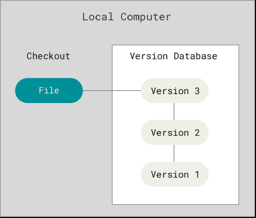
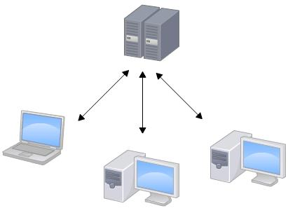
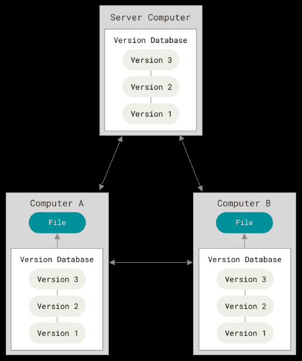

Git 是什么?

Git 是目前世界上最先进的分布式版本控制系统(没有之一)。

<!-- more -->

## 版本控制系统

什么是“版本控制”? 版本控制是一种记录一个或若干文件内容变化，以便将来查阅特定版本修订情况的系统。您可以对任何类型的文件进行版本控制。

- 如果您是位图形或网页设计师，可能会需要保存某一幅图片或页面布局文件的所有修订版本(这或许是您非常渴望拥有的功能)
- 如果您是一名作家，您可能需要保存您对作品的每一次修改以便将来如果随着情节发展需要变动可以撤销它们。
- 甚至您是一名学生，您的论文也可以进行版本控制。
- 哪怕您工作了，保存各种报表的各种版本也是没有坏处的。

在很多情况下，采用版本控制系统(VCS)都是个明智的选择! 有了它您就可以将选定的文件回溯到之前的状态，甚至将整个项目都回退到过去某个时间点的状态，您可以比较文件的变化细节，查出最后是谁修改了哪个地方，从而找出导致怪异问题出现的原因，又是谁在何时报告了某个功能缺陷等等。使用版本控制系统通常还意味着，就算您乱来一气把整个项目中的文件改的改删的删，您也照样可以轻松恢复到原先的样子。但额外增加的工作量却微乎其微。

### 本地版本控制系统

许多人习惯用复制整个项目目录的方式来保存不同的版本，或许还会改名加上备份时间以示区别。这么做唯一的好处就是简单，但是特别容易犯错。有时候会混淆所在的工作目录，一不小心会写错文件或者覆盖意想外的文件。为了解决这个问题，人们很久以前就开发了许多种本地版本控制系统，大多都是采用某种简单的数据库来记录文件的历次更新差异。

::: tip RCS

其中最流行的一种叫做 RCS，现今许多计算机系统上都还看得到它的踪影。RCS 的工作原理是在硬盘上保存补丁集(补丁是指文件修订前后的变化)；通过应用所有的补丁，可以重新计算出各个版本的文件内容。

:::

### 集中化的版本控制系统

接下来人们又遇到一个问题，如何让在不同系统上的开发者协同工作? 于是，集中化的版本控制系统(Centralized Version Control Systems，简称 CVCS)应运而生。这类系统，诸如 CVS、Subversion 以及 Perforce 等，都有一个单一的集中管理的服务器，保存所有文件的修订版本，而协同工作的人们都通过客户端连到这台服务器，取出最新的文件或者提交更新。多年以来，这已成为版本控制系统的标准做法。

集中式版本控制系统版本库是集中存放在中央服务器的，而干活的时候，用的都是自己的电脑，所以要先从中央服务器取得最新的版本，然后开始干活，干完活了，再把自己的活推送给中央服务器。中央服务器就好比是一个图书馆，您要改一本书，必须先从图书馆借出来，然后回到家自己改，改完了，再放回图书馆。

这种做法带来了许多好处，特别是相较于老式的本地 VCS 来说 现在，每个人都可以在一定程度上看到项目中的其他人正在做些什么。而管理员也可以轻松掌控每个开发者的权限，并且管理一个 CVCS 要远比在各个客户端上维护本地数据库来得轻松容易。

CVS 作为最早的开源而且免费的集中式版本控制系统，直到现在还有不少人在用。由于 CVS 自身设计的问题，会造成提交文件不完整，版本库莫名其妙损坏的情况。同样是开源而且免费的 SVN 修正了 CVS 的一些稳定性问题，是目前用得最多的集中式版本库控制系统。

事分两面，有好有坏。集中式版本控制系统最大的毛病就是必须联网才能工作，如果在局域网内还好，带宽够大，速度够快，可如果在互联网上，遇到网速慢的话，可能提交一个 10M 的文件就需要 5 分钟。另外若中央服务器的单点故障。如果宕机一小时，那么在这一小时内，谁都无法提交更新，也就无法协同工作。如果中心数据库所在的磁盘发生损坏，又没有做恰当备份，毫无疑问您将丢失所有数据——包括项目的整个变更历史，只剩下人们在各自机器上保留的单独快照。本地版本控制系统也存在类似问题，只要整个项目的历史记录被保存在单一位置，就有丢失所有历史更新记录的风险。

### 分布式版本控制系统

于是分布式版本控制系统(Distributed Version Control System，简称 DVCS)面世了。

分布式版本控制系统根本没有“中央服务器”，每个人的电脑上都是一个完整的版本库，这样，您工作的时候，就不需要联网了，因为版本库就在您自己的电脑上。既然每个人电脑上都有一个完整的版本库，那多个人如何协作呢? 比方说您在自己电脑上改了文件 A，您的同事也在他的电脑上改了文件 A，这时，您们俩之间只需把各自的修改推送给对方，就可以互相看到对方的修改了。

和集中式版本控制系统相比，分布式版本控制系统的安全性要高很多，因为每个人电脑里都有完整的版本库，某一个人的电脑坏掉了不要紧，随便从其他人那里复制一个就可以了。而集中式版本控制系统的中央服务器要是出了问题，所有人都没法干活了。

::: tip

在实际使用分布式版本控制系统的时候，其实很少在两人之间的电脑上推送版本库的修改，因为可能您们俩不在一个局域网内，两台电脑互相访问不了，也可能今天您的同事病了，他的电脑压根没有开机。因此，分布式版本控制系统通常也有一台充当“中央服务器”的电脑，但这个服务器的作用仅仅是用来方便“交换”大家的修改，没有它大家也一样干活，只是交换修改不方便而已。

:::

在这类系统中，像 Git、Mercurial、Bazaar 以及 Darcs 等，客户端并不只提取最新版本的文件快照，而是把代码仓库完整地镜像下来，包括完整的历史记录。这么一来，任何一处协同工作用的服务器发生故障，事后都可以用任何一个镜像出来的本地仓库恢复。因为每一次的克隆操作，实际上都是一次对代码仓库的完整备份。

更进一步，许多这类系统都可以指定和若干不同的远端代码仓库进行交互。籍此，您就可以在同一个项目中，分别和不同工作小组的人相互协作。您可以根据需要设定不同的协作流程，比如层次模型式的工作流，而这在以前的集中式系统中是无法实现的。
