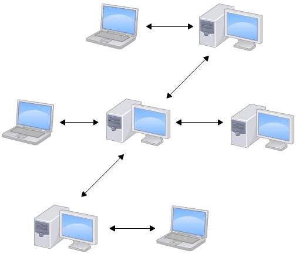

# Git 总体介绍

## 什么是 Git

Git 是什么？

Git 是目前世界上最先进的分布式版本控制系统(没有之一)。

## 版本控制系统

如果您用 Microsoft Word 写过长篇大论，那您一定有这样的经历:

想删除一个段落，又怕将来想恢复找不回来怎么办？有办法，先把当前文件“另存为……”一个新的 Word 文件，再接着改，改到一定程度，再“另存为……”一个新文件，这样一直改下去。过了一周，您想找回被删除的文字，但是已经记不清删除前保存在哪个文件里了，只好一个一个文件去找，真麻烦。

看着一堆乱七八糟的文件，想保留最新的一个，然后把其他的删掉，又怕哪天会用上，还不敢删，真郁闷。

更要命的是，有些部分需要您的财务同事帮助填写，于是您把文件 Copy 到 U 盘里给她(也可能通过 Email 发送一份给她)，然后，您继续修改 Word 文件。一天后，同事再把 Word 文件传给您，此时，您必须想想，发给她之后到您收到她的文件期间，您作了哪些改动，得把您的改动和她的部分合并，真困难。

于是您想，如果有一个软件，不但能自动帮我记录每次文件的改动，还可以让同事协作编辑，这样就不用自己管理一堆类似的文件了，也不需要把文件传来传去。如果想查看某次改动，只需要在软件里瞄一眼就可以，岂不是很方便？

这个软件用起来就应该像这个样子，能记录每次文件的改动:

| 版本 |   文件名    | 用户 |          说明           |    日期    |
| :--: | :---------: | :--: | :---------------------: | :--------: |
|  1   | service.doc | 张三 |  删除了软件服务条款 5   | 7/12 10:38 |
|  2   | service.doc | 张三 | 增加了 License 人数限制 | 7/12 18:09 |
|  3   | service.doc | 李四 | 财务部门调整了合同金额  | 7/13 9:51  |
|  4   | service.doc | 张三 |   延长了免费升级周期    | 7/14 15:17 |

这样，您就结束了手动管理多个“版本”的史前时代，进入到版本控制的 20 世纪。

---

## 分布式的 Git

CVS 及 SVN 都是集中式的版本控制系统，而 Git 是分布式版本控制系统，集中式和分布式版本控制系统有什么区别呢？

### 集中式版本控制系统

集中式版本控制系统版本库是集中存放在中央服务器的，而干活的时候，用的都是自己的电脑，所以要先从中央服务器取得最新的版本，然后开始干活，干完活了，再把自己的活推送给中央服务器。中央服务器就好比是一个图书馆，您要改一本书，必须先从图书馆借出来，然后回到家自己改，改完了，再放回图书馆。

集中式版本控制系统最大的毛病就是必须联网才能工作，如果在局域网内还好，带宽够大，速度够快，可如果在互联网上，遇到网速慢的话，可能提交一个 10M 的文件就需要 5 分钟，这还不得把人给憋死啊。

### 分布式版本控制系统

分布式版本控制系统根本没有“中央服务器”，每个人的电脑上都是一个完整的版本库，这样，您工作的时候，就不需要联网了，因为版本库就在您自己的电脑上。既然每个人电脑上都有一个完整的版本库，那多个人如何协作呢？比方说您在自己电脑上改了文件 A，您的同事也在他的电脑上改了文件 A，这时，您们俩之间只需把各自的修改推送给对方，就可以互相看到对方的修改了。

### 分布式系统的优势

和集中式版本控制系统相比，分布式版本控制系统的安全性要高很多，因为每个人电脑里都有完整的版本库，某一个人的电脑坏掉了不要紧，随便从其他人那里复制一个就可以了。而集中式版本控制系统的中央服务器要是出了问题，所有人都没法干活了。

在实际使用分布式版本控制系统的时候，其实很少在两人之间的电脑上推送版本库的修改，因为可能您们俩不在一个局域网内，两台电脑互相访问不了，也可能今天您的同事病了，他的电脑压根没有开机。因此，分布式版本控制系统通常也有一台充当“中央服务器”的电脑，但这个服务器的作用仅仅是用来方便“交换”大家的修改，没有它大家也一样干活，只是交换修改不方便而已。

当然，Git 的优势不单是不必联网这么简单，后面介绍的 Git 极其强大的分支管理，把 SVN 等远远抛在了后面。

CVS 作为最早的开源而且免费的集中式版本控制系统，直到现在还有不少人在用。由于 CVS 自身设计的问题，会造成提交文件不完整，版本库莫名其妙损坏的情况。同样是开源而且免费的 SVN 修正了 CVS 的一些稳定性问题，是目前用得最多的集中式版本库控制系统。
