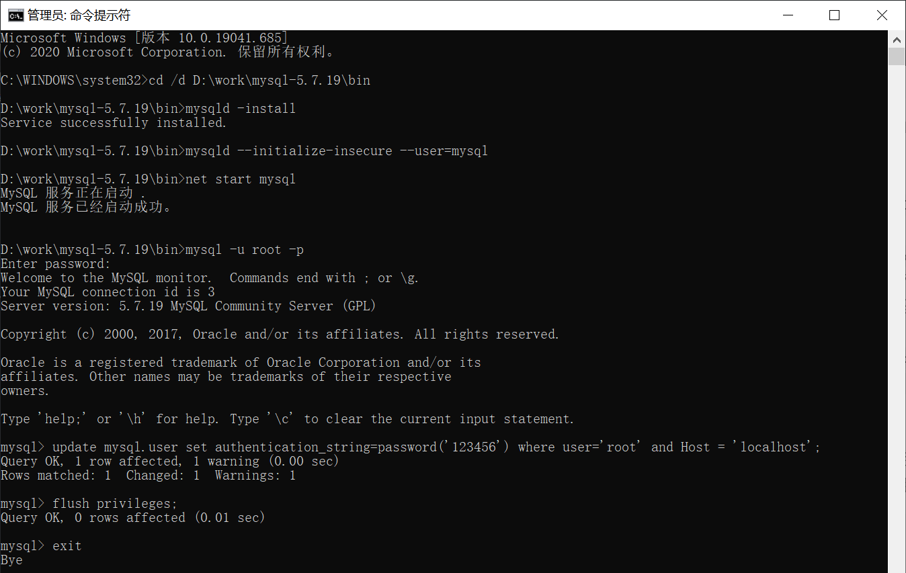
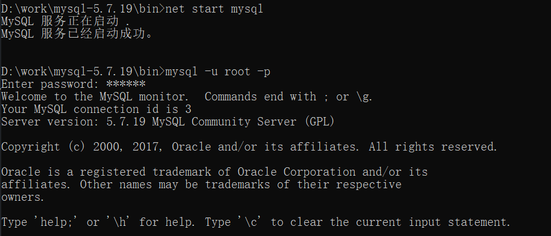

#MySQL

##简介

MySQL是一个关系型数据库管理系统

由瑞典MySQL AB公司开发，属于Oracle旗下产品

是最流行的关系型数据库管理系统之一，是最好的RDBMS关系数据库管理系统应用软件之一

使用SQL语言，分为社区版和商业版，由于其体积小、速度快、总体拥有成本低，尤其是开放源码这一特点，一般中小型网站都选择MySQL作为网站数据库

##安装

下载地址：https://dev.mysql.com/downloads/

在这个下载界面会有几个版本的选择。

1. MySQL Community Server 社区版本，开源免费，但不提供官方技术支持。
2. MySQL Enterprise Edition 企业版本，需付费，可以试用30天。
3. MySQL Cluster 集群版，开源免费。可将几个MySQL Server封装成一个Server。
4. MySQL Cluster CGE 高级集群版，需付费。
5. MySQL Workbench（GUITOOL）一款专为MySQL设计的ER/数据库建模工具。它是著名的数据库设计工具DBDesigner4的继任者。MySQLWorkbench又分为两个版本，分别是社区版（MySQL Workbench OSS）、商用版（MySQL WorkbenchSE）。

MySQL Community Server是开源免费的，这也是我们通常用的MySQL的版本。

1. 下载后得到zip压缩包.

2. 解压到自己想要安装到的目录

3. 添加环境变量：我的电脑->属性->高级->环境变量
    选择PATH,在其后面添加: mysql 安装文件下面的bin文件夹

4. 新建mysql配置文件

    在mysql文件夹中新建my.ini文件,编辑 my.ini 文件,注意替换路径位置
    ```
    [mysqld]
    basedir=D:\Program Files\mysql-5.7\     
    datadir=D:\Program Files\mysql-5.7\data\
    port=3306
    skip-grant-tables
    ```
5. 启动管理员模式下的CMD，输入`cd /d bin目录路径`将路径切换至mysql下的bin目录，然后输入`mysqld –install` (安装mysql)

6. 再输入`mysqld --initialize-insecure --user=mysql` 初始化数据文件
   
7. 然后输入`net start mysql`再次启动mysql,然后用命令 `mysql –u root –p`进入mysql管理界面（密码可为空）

8. 进入界面后更改root密码
`update mysql.user set authentication_string=password('123456') where user='root' and Host = 'localhost';`
9. 刷新权限
`flush privileges;`

    

10. 修改my.ini文件删除最后一句skip-grant-tables

```
[mysqld]
basedir=D:\work\mysql-5.7.19\
datadir=D:\work\mysql-5.7.19\data\
port=3306
#skip-grant-tables
```

11. 重启mysql即可正常使用
```SQL
net stop mysql
net start mysql
```
12. 连接上测试出现以下结果就安装好了
    

##连接数据库

1. 打开MySQL命令窗口
    + 在DOS命令行窗口进入 安装目录\mysql\bin
    + 可设置环境变量，设置了环境变量，可以在任意目录打开！

2. 输入连接数据库语句: 
   `mysql -h 服务器主机地址 -u 用户名 -p 用户密码`

    **-p后面不能加空格,否则会被当做密码的内容,导致登录失败 !**

##几个基本的数据库操作命令
```SQL
mysql -h 服务器主机地址 -u 用户名 -p 用户密码 连接数据库

update user set password=password('123456')where user='root'; 修改密码

flush privileges; 刷新数据库

show databases; 显示所有数据库

use dbname；打开某个数据库

show tables; 显示数据库mysql中所有的表

describe user; 显示表mysql数据库中user表的列信息

create database name; 创建数据库

use databasename; 选择数据库

exit; 退出Mysql

? 命令关键词 : 寻求帮助

-- 表示注释
```

##数据库基本操作

####操作数据库
1. 创建数据库
   ```sql
   CREATE DATABASE name;
   ```
2. 显示数据库
    ```sql
    show databases;
    ```

    **注意：为了不再显示的时候乱码，要修改数据库默认编码。以下以GBK编码页面为例进行说明：

    >1、修改MYSQL的配置文件：my.ini里面修改default-character-set=gbk
    >2、代码运行时修改：
    ①Java代码：jdbc:mysql://localhost:3306/test?useUnicode=true&characterEncoding=gbk
    ②PHP代码：header("Content-Type:text/html;charset=gb2312");
    ③C语言代码：int mysql_set_character_set( MYSQL * mysql, char * csname)；
    该函数用于为当前连接设置默认的字符集。字符串csname指定了1个有效的字符集名称。连接校对成为字符集的默认校对。该函数的工作方式与SET NAMES语句类似，但它还能设置mysql- > charset的值，从而影响了由mysql_real_escape_string() 设置的字符集。

3. 删除数据库 
    ```sql
    drop database name;
    ```
    >删除一个已经确定存在的数据库
   ```sql
   drop database name;
   ```

    >删除一个不确定存在的数据库
   ```sql
   drop database if exists name;
   ```

4. 选择数据库
    ```sql
    use name;
    ```
    >use 语句可以通过MySQL把name数据库作为默认（当前）数据库使用，用于后续语句。该数据库保持为默认数据库，直到语段的结尾，或者直到发布一个不同的USE语句：
   
    >使用use语句为一个特定的当前的数据库做标记，不会阻碍您访问其它数据库中的表。下面的例子可以从db1数据库访问作者表，并从db2数据库访问编辑表：
    ```sql
    mysql> USE db1;
    mysql> SELECT author_name,editor_name FROM author,db2.editor
        ->        WHERE author.editor_id = db2.editor.editor_id;
    ```

    >USE语句被设立出来，用于与Sybase相兼容。
    
    >use 数据库后，使用show databases就能查询所有数据库，如果想跳到其他数据库，用use 其他数据库名字就可以了。

5. 当前选择的数据库

    ```sql
    select database();
    ```
    >MySQL中SELECT命令类似于其他编程语言里的print或者write，你可以用它来显示一个字符串、数字、数学表达式的结果等等。

    >1. 显示MYSQL的版本
    ```sql
    mysql> select version(); 
    +-----------------------+ 
    | version()             | 
    +-----------------------+ 
    | 6.0.4-alpha-community | 
    +-----------------------+ 
    1 row in set (0.02 sec) 
    ```
    >2. 显示当前时间
    ```sql
    mysql> select now(); 
    +---------------------+ 
    | now()               | 
    +---------------------+ 
    | 2009-09-15 22:35:32 | 
    +---------------------+ 
    1 row in set (0.04 sec) 
    ```
    >3. 显示年月日
    ```sql
    SELECT DAYOFMONTH(CURRENT_DATE); 
    +--------------------------+ 
    | DAYOFMONTH(CURRENT_DATE) | 
    +--------------------------+ 
    |                       15 | 
    +--------------------------+ 
    1 row in set (0.01 sec) 
    ```
    ```sql
    SELECT MONTH(CURRENT_DATE); 
    +---------------------+ 
    | MONTH(CURRENT_DATE) | 
    +---------------------+ 
    |                   9 | 
    +---------------------+ 
    1 row in set (0.00 sec) 
    ```
    ```sql
    SELECT YEAR(CURRENT_DATE); 
    +--------------------+ 
    | YEAR(CURRENT_DATE) | 
    +--------------------+ 
    |               2009 | 
    +--------------------+ 
    1 row in set (0.00 sec) 
    ```
    >4. 显示字符串
    ```sql
    mysql> SELECT "welecome to my blog!"; 
    +----------------------+ 
    | welecome to my blog! | 
    +----------------------+ 
    | welecome to my blog! | 
    +----------------------+ 
    1 row in set (0.00 sec) 
    ```
    >5. 当计算器用
    ```sql
    select ((4 * 4) / 10 ) + 25; 
    +----------------------+ 
    | ((4 * 4) / 10 ) + 25 | 
    +----------------------+ 
    |                26.60 | 
    +----------------------+ 
    1 row in set (0.00 sec) 
    ```
    >6. 串接字符串
    ```sql
    select CONCAT(f_name, " ", l_name) 
    AS Name 
    from employee_data 
    where title = 'Marketing Executive'; 
    +---------------+ 
    | Name          | 
    +---------------+ 
    | Monica Sehgal | 
    | Hal Simlai    | 
    | Joseph Irvine | 
    +---------------+ 
    3 rows in set (0.00 sec) 
    ```
    >注意：这里用到`CONCAT()`函数，用来把字符串串接起来。另外，用AS给结果列'CONCAT(f_name, " ", l_name)'起了个假名。


####操作数据表
1. 创建数据表
    ```sql
    create table <表名> ( <字段名1> <类型1> [,..<字段名n> <类型n>]);
    ```
    例如，建立一个名为User的表，
    |字段名|数字类型|数据宽度|是否为空|是否主键|自动增加|默认值|
    |-|-|-|-|-|-|-|
    |id	    |int	|4	|否	|primary key|auto_increment||
    |name	|char	|20	|否	 	 	 
    |sex	|int	|4	|否	|||0
    ```SQL 	 
    mysql> create table MyClass(
        -> id int(4) not null primary key auto_increment,
        -> name char(20) not null,
        -> sex int(4) not null default '0');
    ```

2. 删除数据表
    ```sql
    drop table <表名>
    ```
    >`DROP TABLE`用于取消一个或多个表。您必须有每个表的`DROP`权限。所有的表数据和表定义会被取消，所以使用本语句要小心！

    >注意：对于一个带分区的表，`DROP TABLE`会永久性地取消表定义，取消各分区，并取消储存在这些分区中的所有数据。`DROP TABLE`还会取消与被取消的表有关联的分区定义（.par）文件。

    >对于不存在的表，使用`IF EXISTS`用于防止错误发生。当使用`IF EXISTS`时，对于每个不存在的表，会生成一个`NOTE`。

3. 向表中插入数据

    ```sql
    insert into <表名> [( <字段名1>[,..<字段名n > ])] values ( 值1 )[, ( 值n )]
    ```
    >例如：往表MyClass中插入二条记录, 
    >编号为1的名为Tom的性别为0, 
    >编号为2 的名为Joan 的性别为1
    ```sql
    mysql> insert into MyClass values(1,'Tom',0),(2,'Joan',1);
    ```
    >注意：insert into每次只能向表中插入一条记录。

4. 查询数据表中的数据
    ```sql
    select <字段1，字段2，...> from < 表名 > where < 表达式 >
    ```
    1. 查询所有行
    >例如：查看表 MyClass 中所有数据
    ```sql
    mysql> select * from MyClass;
    ```
    2. 查询前几行数据
    >例如：查看表 MyClass 中前2行数据
    ```sql
    mysql> select * from MyClass order by id limit 0,2;
    ```
    >select一般配合where使用，以查询更精确更复杂的数据

5. 删除数据表中的数据
    ```sql
    delete from 表名 where 表达式
    ```
    >例如：删除表 MyClass中编号为1 的记录
    ```sql
    mysql> delete from MyClass where id=1;
    ```
    >下面是一个删除数据前后表的对比。
    ```sql
    mysql> select * from MyClass;
    +----+------+-----+
    | id | name | sex |
    +----+------+-----+
    |  1 | Tom  |   0 |
    |  2 | Joan |   1 |
    +----+------+-----+
    2 rows in set (0.00 sec)

    mysql> delete from MyClass where id=1;
    Query OK, 1 row affected (0.02 sec)

    mysql> select * from MyClass;
    +----+------+-----+
    | id | name | sex |
    +----+------+-----+
    |  2 | Joan |   1 |
    +----+------+-----+
    1 row in set (0.00 sec)
    ```

6. 修改数据表中的数据
    ```sql
    update 表名 set 字段=新值,… where 条件
    ```
    ```sql
    select * from MyClass;
    +----+------+-----+
    | id | name | sex |
    +----+------+-----+
    |  2 | Joan |   1 |
    +----+------+-----+
    1 row in set (0.00 sec)

    mysql> update MyClass set name='Mary' where id=2;
    Query OK, 1 row affected (0.01 sec)
    Rows matched: 1  Changed: 1  Warnings: 0

    mysql> select * from MyClass;
    +----+------+-----+
    | id | name | sex |
    +----+------+-----+
    |  2 | Mary |   1 |
    +----+------+-----+
    1 row in set (0.00 sec)
    ```

    >`UPDATE`语法可以用新值更新原有表行中的各列。
    >`SET`子句指示要修改哪些列和要给予哪些值。
    >`WHERE`子句指定应更新哪些行。如果没有WHERE子句，则更新所有的行。
    
7. 增加数据
    1. 增加字段
        ```sql
        alter table 表名 add 字段 类型 其他;
        ```
        >例如：在表MyClass中添加了一个字段age，类型为int(4)，默认值为0
        ```sql
        mysql> alter table MyClass add age int(4) default '0'
        ```
    2. 修改原字段名称及类型：
    ```sql
    ALTER TABLE table_name CHANGE old_field_name new_field_name field_type;
    ```

    3. 删除字段：
    ```sql
    MySQL ALTER TABLE table_name DROP field_name;
    ```
    4. 加索引
        ```sql
        alter table 表名 add index 索引名 (字段名1[，字段名2 …]);
        ```
        >例子： 
        mysql> alter table employee add index emp_name (name);

    5. 加主关键字的索引
    ```sql
    alter table 表名 add primary key (字段名);
    ```
    >例子： 
    mysql> alter table employee add primary key(id);

    6. 加唯一限制条件的索引
    ```sql
    alter table 表名 add unique 索引名 (字段名);
    ```
    >例子： 
    mysql> alter table employee add unique emp_name2(cardnumber);

    7. 删除某个索引
    ```sql
    alter table 表名 drop index 索引名;
    sql
    >例子： 
    mysql>alter table employee drop index emp_name;

8. 修改表名
    ```sql
    rename table 原表名 to 新表名;
    ```
    >当你执行 `RENAME` 时，你不能有任何锁定的表或活动的事务。你同样也必须有对原初表的 `ALTER` 和 `DROP` 权限，以及对新表的 `CREATE` 和 `INSERT` 权限。

    >如果在多表更名中，MySQL 遭遇到任何错误，它将对所有被更名的表进行倒退更名，将每件事物退回到最初状态。

    >`RENAME TABLE` 在 `MySQL 3.23.23` 中被加入。
