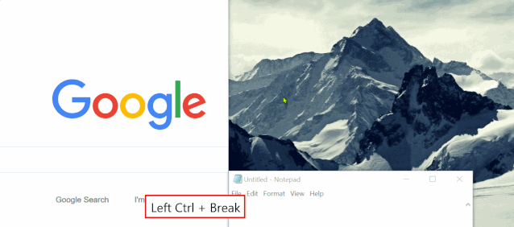
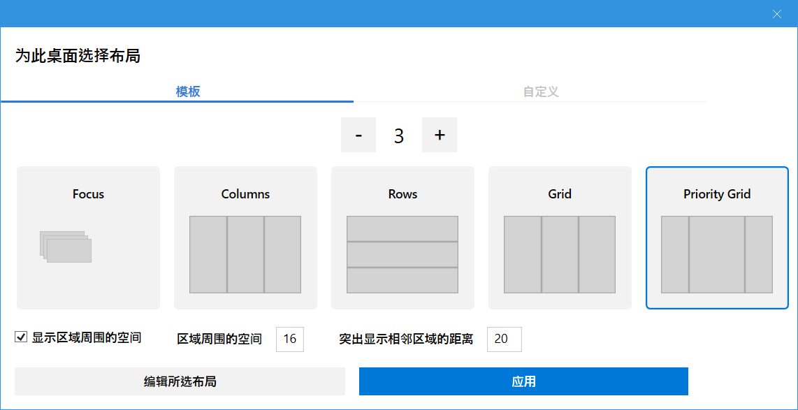
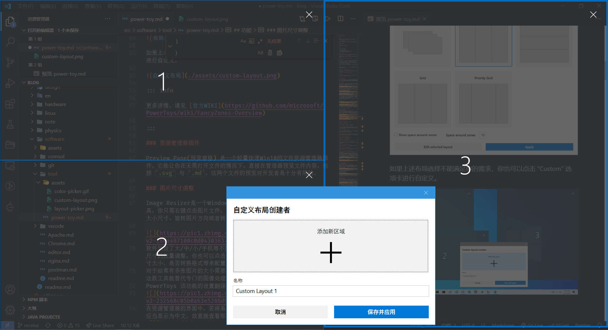
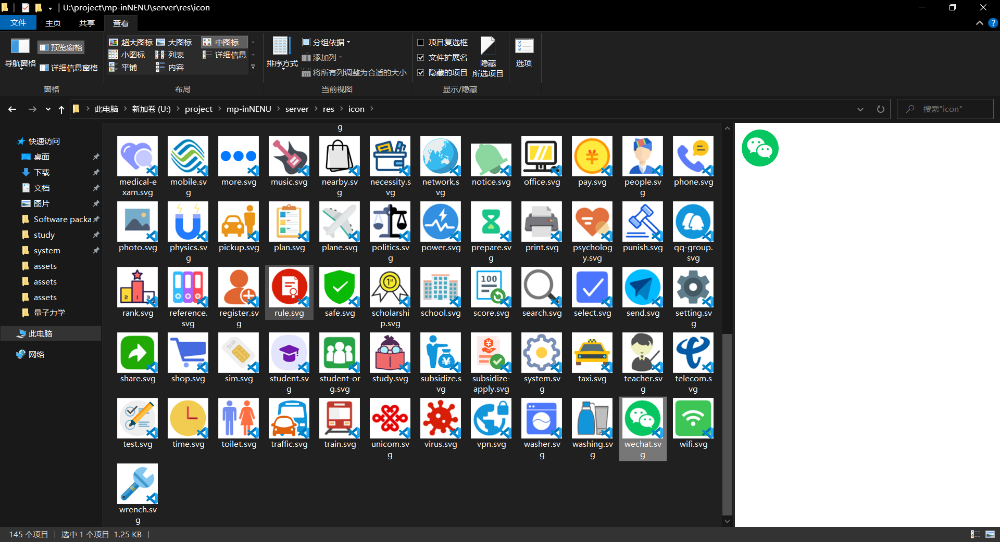
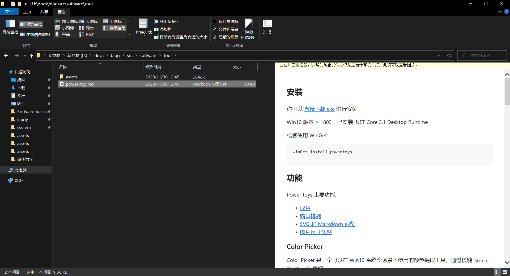
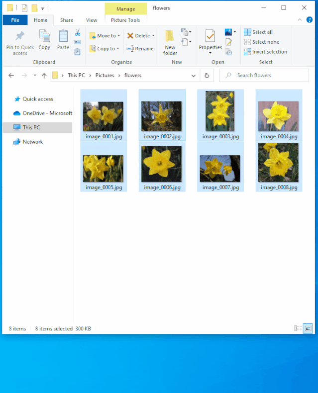
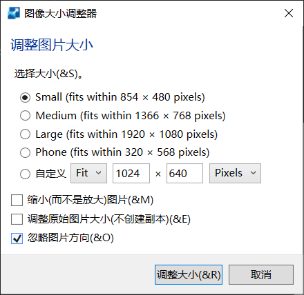
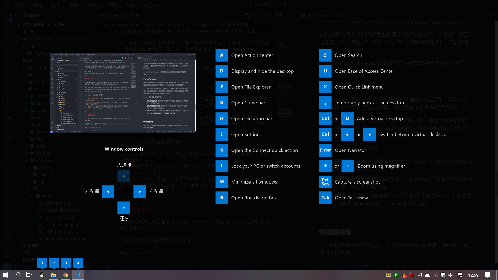

## 安装

您可以:

- [从 Microsoft Store 的 PowerToys 页面](https://aka.ms/getPowertoys) 进行安装

- [直接下载 exe](https://github.com/microsoft/PowerToys/releases) 进行安装。

- 使用 WinGet:

  ```shell
  winget install Microsoft.PowerToys --source winget
  ```

## 当前 PowerToy 实用工具

当前可用的实用工具包括：

### Always on Top

Always on Top 使你能够使用快捷键 (⊞ Win+Ctrl+T) 将窗口固定在其他窗口之上。

### PowerToys Awake

PowerToys Awake 旨在使计算机保持唤醒状态，且无需管理其电源和睡眠设置。 运行耗时较长的任务时，此行为非常有用，可确保计算机不会进入睡眠状态或关闭其显示屏。

### 颜色选取器

颜色选取器是一种系统范围的颜色选取实用工具，通过 `Win` + `Shift` + `C` 进行激活。 从屏幕上的任意位置选取颜色，选取器会自动以设置的格式将颜色复制到剪贴板。 颜色选取器还包含一个编辑器，其中显示了之前选取的颜色的历史记录，你可用它来微调所选颜色并复制不同的字符串表示形式。



### 裁剪和锁定

裁剪和锁定是一个实用工具，用于创建一个新窗口，该窗口是另一个窗口的裁剪窗口或缩略图。

### 环境变量

环境变量提供了一种简单便捷的方式来管理环境变量。 利用它，还可以创建配置文件来统一管理一组变量。

### FancyZones

FancyZones 是一种窗口管理器，可用于轻松创建复杂的窗口布局，并将窗口快速放入到这些布局中。

FancyZones 实现了更高效地利用屏幕的面积，管理切换大量窗口而不杂乱，是大屏幕用户必备的效率工具，快捷键为 `` Win + ` ``

当首次启动时，FancyZones 会要求您为当前显示器选择一个默认的布局。

::: tip

请注意 FancyZones 布局是基于显示器的，所以如果您有多个显示器，您需要分别设置它们。



如果上述布局选择不能满足您的需求，您也可以点击 "Custom" 选项卡进行自定义。



:::

### 资源管理器加载项

资源管理器加载项支持资源管理器中的预览窗格和缩略图呈现以显示各种文件类型。 若要启用预览窗格，请在资源管理器中选择“视图”选项卡，然后选择“预览窗格”。





### File Locksmith

File Locksmith 是一个 Windows shell 扩展，用于检查哪些文件正在使用中以及由哪些进程使用。 右键单击资源管理器中的一个或多个选定文件，然后选择“什么进程正在使用此文件?”。

### 主机文件编辑器

主机文件编辑器是一种编辑包含域名和匹配 IP 地址的“主机”文件的便捷方式，充当一个用于识别和定位 IP 网络上主机的映射。

### 图像大小调整器

图像大小调整器是一种用于快速调整图像大小的 Windows Shell 扩展。 只需在 资源管理器中简单右键单击一下，立即就能调整一张或多张图像的大小。

用户可选择修改一张或批量修改多张图片的大小尺寸、旋转图片方向或者转换图片格式。



软件预设了大/中/小/手机等不同的常用模版，单击确定即可一键完成图片尺寸的批量调整。您也可以点击 Settings 进入设置，按自己需求的尺寸大小、是否转换格式等来配置自己的常用“模版”。



对于经常有多张图片的大小需要处理，而对专业性要求不高的用户来说，这款工具能替代专门的图像处理器软件。

同时，用户不仅可以导出为其他格式，也可以设置默认编码器(在不能保存为原始格式时)。

在导出时，也支持修改 PNG、JPEG 和 TIFF 的图片保存设置，与是否保留原来的最后修改日期。

### 键盘管理器

通过键盘管理器，可重新映射键和创建自己的键盘快捷方式，从而自定义键盘来提高工作效率。

它的主要作用能帮您将键盘上的某个按键映射为另一个按键，甚至还能将一组快捷键映射为另一组。在一些特殊的情况下，它能帮您的大忙。

::: tip

Keyboard Manager 修改键位之后无需重启电脑即可立即生效。

:::

### 鼠标实用程序

鼠标实用程序添加了用于增强鼠标和光标的功能。 使用“查找我的鼠标”，通过聚焦于光标的焦点快速查找鼠标的位置。 此功能基于由 Raymond Chen 开发的源代码。 单击鼠标左键或右键时，鼠标荧光笔会显示可视指示器。 鼠标跳转使你可以在大型显示屏上快速跳转。 鼠标指针十字准线以鼠标指针为中心绘制十字准线。

### 无边框鼠标

借助无边框鼠标，你可以使用同一个键盘和鼠标与多台计算机进行交互，在计算机之间无缝共享剪贴板内容和文件。

### 粘贴为纯文本

通过粘贴为纯文本，可以使用快捷键 (`Ctrl` + `Win` + `V`) 以不带格式的方式粘贴剪贴板中的文本。

### 速览

使用速览可以预览文件内容，而无需打开多个应用程序或中断工作流。 只需选择文件并使用快捷方式（`Ctrl` + `Space`）

### PowerRename

通过 PowerRename，可执行批量重命名，搜索和替换文件名称。 它附带高级功能，例如使用正则表达式、面向特定文件类型、预览预期结果和撤消更改的能力。

为了避免出错，它在重命名之前可以让在界面上预览重命名后的结果，同时在重命名时，您可以很方便的选中全部您想要重命名的文件与文件夹，再排除指定的文件/文件夹。

::: tip 一些设置选项的解释

- **使用正则表达式**: 默认搜索框中为文字匹配，启用后将认为搜索框中为正则表达式。
- **匹配所有出现的对象**: 默认情况下只匹配项目中搜索文本的第一个实例，勾选后匹配所有。
- **枚举项**: 勾选后，会在在操作中修改的文件名后追加一个数字后缀。例如: `mrhope.jpg` -> `mrhope (1).jpg`

:::

### Quick Accent

Quick Accent 是键入重音字符的替代方法，当键盘不支持具有快捷键组合的特定重音时，此方法非常有用。

### 注册表预览版

注册表预览版是用于可视化和编辑 Windows 注册表文件的实用工具。

### PowerToys Run

PowerToys Run 可帮助你立即搜索和启动应用。 如需打开，可使用快捷方式 `Alt` + `Space` ，然后开始键入。 对其他插件来说，它是开源和模块化的。

#### 功能

- 搜索

  直接输入名字后，它能快速找到对应的软件、搜索文件/文件夹，并回车迅速打开它们。

  

- 运行软件切换

  PowerToys Run 也支持快速搜索当前正在运行的软件，并切换到它们的窗口去。

- 终端

  输入 `>` 加您需要执行的命令，即可快速调用终端执行。

  

- 简单计算

  您可以直接输入简单的数学表达式，PowerToys Run 会直接返回结果。

  

#### 快捷键

| 捷径                   | 行动                                                     |
| ---------------------- | -------------------------------------------------------- |
| `Alt + Space`          | 打开或隐藏 PowerToys Run                                 |
| `Esc`                  | 隐藏 PowerToys Run                                       |
| `Ctrl + Shift + Enter` | (仅适用于应用程序)以管理员身份打开所选的应用程序         |
| `Ctrl + Shift + E`     | (仅适用于应用程序和文件)在文件资源管理器中打开包含文件夹 |
| `Ctrl + C`             | (仅适用于文件夹和文件)复制路径位置                       |
| `Tab`                  | 浏览搜索结果和上下文菜单按钮                             |

#### 过滤符

这些将迫使 PowerToys 只运行目标插件。

| 过滤符 | 行动            |
| ------ | --------------- |
| `=`    | 仅计算器。      |
| `?`    | 仅文件搜索。    |
| `.`    | 仅搜索安装应用  |
| `//`   | 仅网址。        |
| `<`    | 仅运行进程。    |
| `>`    | 仅 Shell 命令。 |

### 屏幕标尺

借助屏幕标尺，可根据图像边缘检测快速测量屏幕上的像素。 如需激活，可使用快捷方式 `Win` + `Shift` + `M`。

### 快捷键指南

按下 `Win` + `Shift` + `/`（或者我们喜欢的 `Win` + `?`）时，会出现 Windows 快捷键指南，并显示桌面当前状态的可用快捷方式。



### 文本提取器

文本提取器是一种从屏幕上任意位置复制文本的便捷方法。 如需激活，可使用快捷方式 `Win` + `Shift` + `T`。

### 视频会议静音

视频会议静音是在会议通话期间使用 `Win`+ `Shift` + `Q` 对麦克风和相机“全局”静音的一种快捷方式，它不考虑当前聚焦在哪个应用程序上。

- `Win + Shiht + Q`: 同时切换音频和视频
- `Win + Shift + O`: 切换视频
- `Win + Shift + A`: 切换麦克风

## 更多

::: info

有关 PowerToys 的详细内容，详见 [PowerToys 官方文档](https://docs.microsoft.com/zh-cn/windows/powertoys/)。

:::
