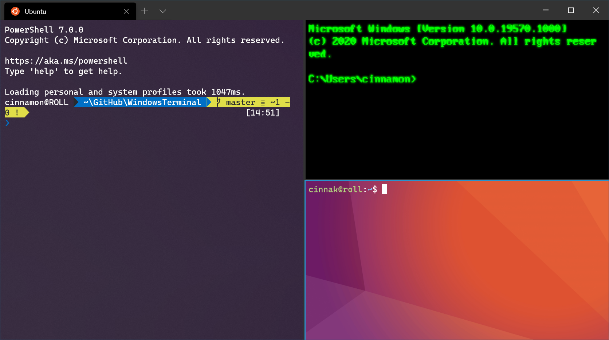

Windows Terminal 是一个面向命令行工具和 shell(如命令提示符、PowerShell 和适用于 Linux 的 Windows 子系统 (WSL))用户的新式终端应用程序。

<!-- more -->

## 特点

- 多选项卡与窗格

  可以同时运行多个终端并自由布局与切换

- 自定义方案和配置

  可在 Windows Terminal 中使用多种自定义命令，获得更加自然的体验。 如果不喜欢特定的键盘快捷方式，可以将其更改为您喜欢的方式。

- 强大的可配置主题

  可以自由配置 Windows Terminal 的配色方案

  可以在 Windows Terminal 窗口中显示背景图像和 GIF

- 扩展性，支持连接众多平台

  任何具有命令行接口的应用程序都可以在 Windows Terminal 中运行。 这包括从 PowerShell 和命令提示符到 Azure Cloud Shell 和任何 WSL 分发 (如 Ubuntu 或 Oh-My-Zsh) 的所有应用程序。

- Unicode 和 UTF-8 字符支持

  Windows Terminal 可以显示 Unicode 和 UTF-8 字符，如各种语言的表情符号和字符。

- GPU 加速文本呈现引擎

  Windows Terminal 使用 GPU 来呈现其文本，从而提供比默认 Windows 命令行体验更好的性能。

- 开源

## 教程

- [快速上手](get-started.md)
- [自定义设置](settings.md)

## 官方文档

::: info

有关 Windows 终端的详细内容，详见 [Windows 终端官方文档](https://docs.microsoft.com/zh-cn/windows/terminal/)。

:::
