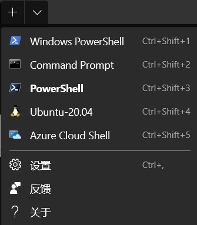

## 安装

您可以通过 [Microsoft Store](https://aka.ms/terminal) 进行安装，同样您可以访问 [GitHub release](https://github.com/microsoft/terminal/releases/) 下载任意版本可执行文件。

::: warning

从 GitHub 安装，终端将不会自动更新为新版本。

:::

## 使用

打开终端时，Windows Terminal 会在打开的选项卡中通过 PowerShell 作为默认配置文件启动。

如果已安装 WSL(Windows Subsystem for Linux) 发行版或多个版本的 PowerShell，终端将自动为您创建配置文件。

### 打开新选项卡

您可以使用 `Ctrl + Shift + T` 快捷键或选择 + (加号)按钮，打开默认配置文件的新选项卡。

若要打开其他配置文件，请选择 + 按钮旁的 ˅(箭头)打开下拉菜单，从中选择要打开的配置文件。



### 打开新窗格

可以使用窗格并行运行多个 shell。 若要打开窗格，可以使用 `Alt + Shift + D`。 此键绑定将打开焦点配置文件的重复窗格。

### 配置

若要自定义 Windows Terminal 的设置，请在下拉菜单中选择“设置”。 这会在默认文本编辑器中打开 settings.json 文件。

终端支持自定义影响整个应用程序的全局属性、影响每个配置文件的设置的配置文件属性以及允许您使用键盘与终端交互的键绑定。

::: info 命令行参数

可以使用命令行参数在特定配置中启动终端。 这些参数允许通过自定义配置文件设置打开具有特定选项卡和窗格的终端。

:::

详情请见 [自定义设置](settings.md)。

## 命令行

可以使用 `wt.exe` 从命令行打开 Windows 终端的新实例。 还可以改为使用执行别名 `wt`。

### 语法

`wt` 命令行接受两种类型的值: “选项”和“命令” 。 “选项”是一系列标志和其他参数，可以将 `wt` 命令行的行为作为一个整体来控制。 “命令”提供应该实现的操作或操作列表(以分号分隔)。 如果未指定命令，则默认情况下会将命令指定为 `new-tab`。

```bash
wt [options] [command ; ]
```

::: tip

若要显示列出可用命令行参数的帮助消息，请输入 `wt -h`

:::

### 选项和命令

下面是 wt 命令行支持的命令和选项的完整列表。

| 选项                       | 说明                   |
| -------------------------- | ---------------------- |
| `--help`、`-h`、`-?`、`/?` | 显示帮助消息。         |
| `--maximized`、`-M`        | 以最大化形式启动终端。 |
| `--fullscreen`、`-F`       | 以全屏形式启动终端。   |

| 命令         | 参数                                                                                                                                       | 说明               |
| ------------ | ------------------------------------------------------------------------------------------------------------------------------------------ | ------------------ |
| `new-tab`    | `--profile, -p profile-name`、`--startingDirectory, -d starting-directory`、`commandline`、`--title`                                       | 创建新选项卡。     |
| `split-pane` | `-H, --horizontal`、`-V, --vertical`、`--profile, -p profile-name`、`--startingDirectory, -d starting-directory`、`commandline`、`--title` | 拆分新窗格。       |
| `focus-tab`  | `--target`, `-t` `tab-index`                                                                                                               | 聚焦于特定选项卡。 |

### 参数

- `-p` 标志用于指定应打开的 Windows 终端配置文件。

  ::: details 例子

  打开 Ubuntu 20.04:

  ```bash
  wt -p "Ubuntu-20.04"
  ```

  :::

- `-d` 标志用于指定起始目录

  ::: details 例子

  设置起始目录为 `D:\`:

  ```bash
  wt -d d:\
  ```

  :::

## 命令面板

通过命令面板，可以查看可以在 Windows Terminal 中运行的操作。

您可以通过键入 `Ctrl + Shift + P` 来调用命令面板。您可以将 `commandPalette` 命令添加到设置文件中的 `actions` 中进行自定义。

### 向命令添加图标

您可以通过在配置中添加 `icon` 为您的命令添加图标。图标可以是图像的路径，[Segoe MDL2 Assets](https://docs.microsoft.com/en-us/windows/uwp/design/style/segoe-ui-symbol-font) 中的符号或任何字符，包括表情符号。

```json
[
  {
    "icon": "C:\\Images\\my-icon.png",
    "name": "New tab",
    "command": "newTab",
    "keys": "ctrl+shift+t"
  },
  {
    "icon": "\uE756",
    "name": "New tab",
    "command": "newTab",
    "keys": "ctrl+shift+t"
  },
  {
    "icon": "⚡",
    "name": "New tab",
    "command": "newTab",
    "keys": "ctrl+shift+t"
  }
]
```

### 嵌套命令

嵌套命令使您可以将多个命令分组在命令面板中的一项下。下面的示例将字体大小调整命令归为一个名为“更改字体大小...”的命令选项板项。

```json
{
  "name": "Change font size...",
  "commands": [
    { "command": { "action": "adjustFontSize", "delta": 1 } },
    { "command": { "action": "adjustFontSize", "delta": -1 } },
    { "command": "resetFontSize" }
  ]
}
```

### 可迭代的命令

可迭代的命令使您可以同时创建多个命令，这些命令是从设置中定义的其他对象生成的。当前，您可以为配置文件和配色方案创建可迭代的命令。在运行时，对于给定类型的每个对象，这些命令将扩展为一个命令。

当前，您可以遍历以下属性:

| iterateOn  | 属性   | 属性语法                    |
| ---------- | ------ | --------------------------- |
| `profiles` | `name` | `"name": "${profile.name}"` |
| `profiles` | `icon` | `"icon": "${profile.icon}"` |
| `schemes`  | `name` | `"name": "${scheme.name}"`  |

### 隐藏命令

如果要将命令保留在键绑定列表中，但又不想让它出现在命令选项板中，则可以通过将 `name` 设置为 `null` 来隐藏它。

::: details 例子

在命令面板中隐藏“新建选项卡”操作:

```json
{ "name": null, "command": "newTab", "keys": "ctrl+shift+t" }
```

:::

## 搜索

您可以使用 `Ctrl + F` 快捷键在终端中进行搜索。

## 窗格

通过窗格，您可以在同一个选项卡中并行运行多个命令行应用程序。这可以最大程度地减少在选项卡之间切换的需求，以便您一次查看多个提示符。

### 创建新窗格

- `Alt + Shift+ +` 创建默认配置文件的新垂直窗格，
- `Alt + Shift+ -` 创建默认配置文件的新水平窗格，

如果希望通过下拉菜单打开新窗格，可以按住 `Alt` 并单击所需的配置文件。 这会将活动窗口或窗格拆分为所选配置文件的新窗格。

> 此拆分模式按具有最长边缘(可用于创建窗格)的方向进行拆分。

### 在窗格间进行切换

按住 alt 键，则可以使用箭头键在窗格之间移动焦点。

### 调整窗格大小

可以按住 `Alt + Shift` 并使用箭头键调整焦点窗格的大小，从而调整窗格的大小。

### 关闭窗格

可以键入 `Ctrl + Shift + W` 来关闭焦点窗格。

如果只有一个窗格，`Ctrl + Shift + W` 将关闭该选项卡。

与往常一样，关闭最后一个选项卡将关闭该窗口。
