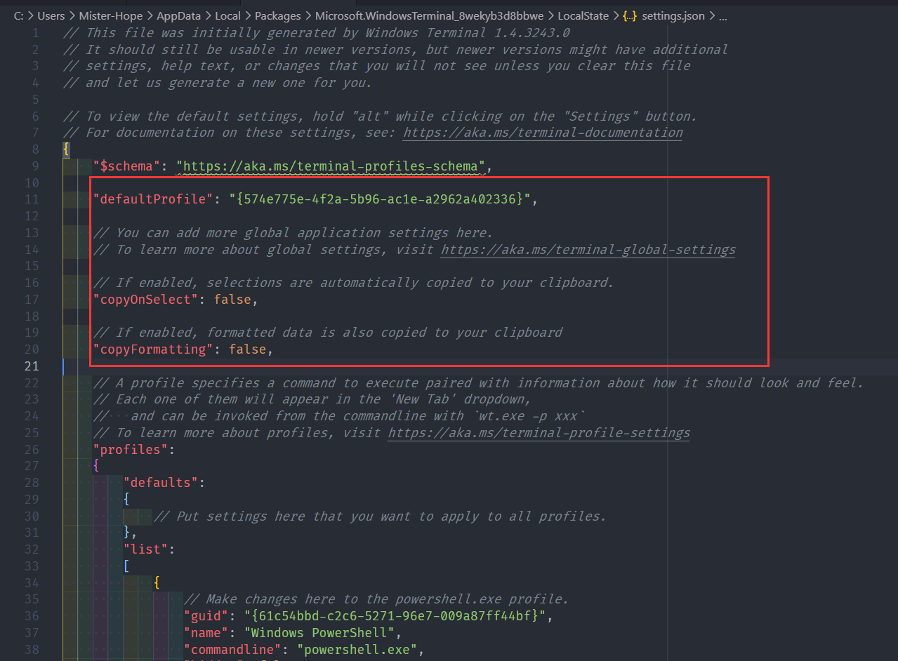
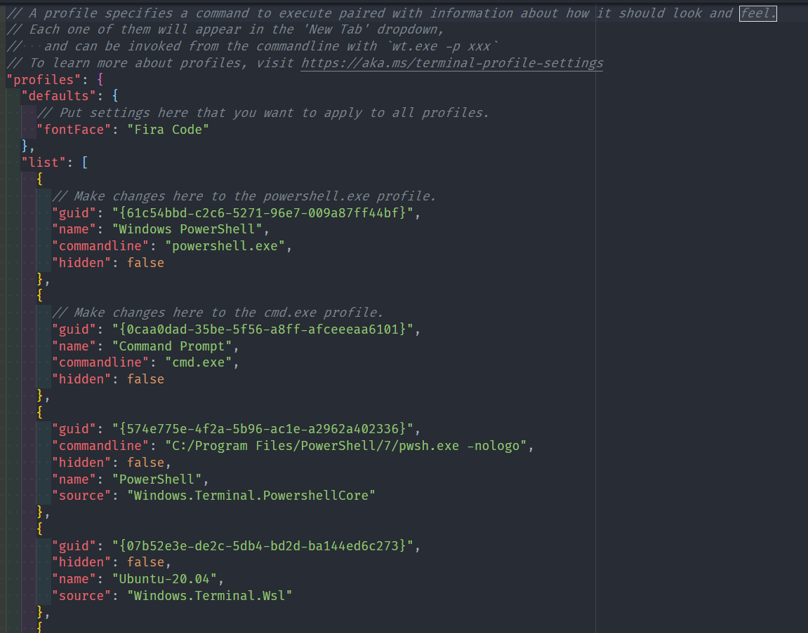
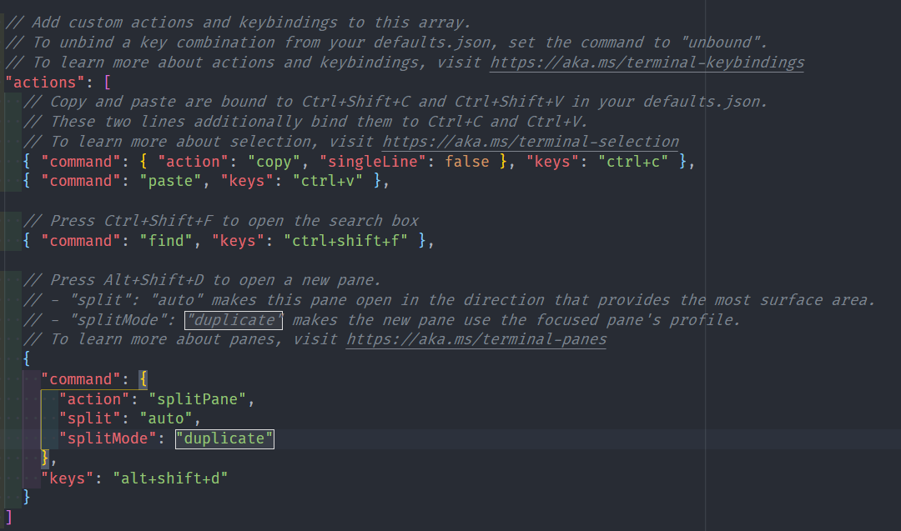

配置文件代表着您可以在 Windows Terminal 中配置的不同的命令行环境。默认情况下，每个配置文件使用不同的命令行可执行程序，但是您可以根据自己的喜好，创建任意数量的使用同一可执行程序的配置文件。每个配置文件可以有自己的定制项以帮助您区分它们，并可以自由定制。

可以使用快捷键 `Ctrl + Shift + *` 来打开对应的配置文件，可使用 `Ctrl + ,` 打开 settings.json 文件，来进行个性化调整和默认设置更改等设置。

<!-- more -->

::: tip 默认设置

您可以通过按住 Alt 键并点击下拉菜单中的 Settings 按钮打开 defaults.json。该文件由 Terminal 自动生成，展示了 Windows Terminal 所有默认设置及其值。更改此文件是无效的。

:::

settings.json 文件分为四个主要部分:

1. 全局设置对象，它位于 JSON 文件的顶部。全局设置将影响整个应用程序。
1. 配置文件设置，由 `profiles` 对象控制。负责控制每个配置文件。
1. 配色方案，由 `schemes` 数组控制。
1. 自定义操作，由 `actions` 数组控制

## 全局设置

全局设置会将影响整个终端窗口。

关于详细的配置项，请见 [全局设置](https://aka.ms/terminal-global-settings)。



### 默认配置文件

默认配置文件为 Windows PowerShell。您可以通过在 settings.json 文件中将 `defaultProfile` 设置为首选配置文件的名称或 GUID 来更改默认配置文件。

```json
"defaultProfile": "PowerShell"
```

## 配置文件设置

`profiles` 对象描述配置文件。它分为两个部分: `defaults` 和 `list`。

- `defaults` 对象中的配置文件会应用于列表中的所有项目。

- `list` 包含代表配置文件的每个配置文件对象，这些是出现在 Windows Terminal 下拉菜单中的项目。应用于 `list` 中各个配置文件的设置会覆盖 `defaults` 部分中应用的设置。

关于详细的配置项，请见 [配置文件设置](https://aka.ms/terminal-profile-settings)。



::: tip

- 您可以在 `defaults` 中设置 `fontFace` 控制终端的字体。

- 您可以在 Powershell 配置文件中添加 `commandline` 为 `<PowerShell 地址> -nologo` 来去除 powershell 启动时的 logo 显示。(默认地址为: `C:/Program Files/PowerShell/7/pwsh.exe`)

- 您可以通过设置 `backgroundImage` 自定义背景图片，通过 `backgroundImageOpacity` 自定义背景透明度，通过 `useAcrylic` 开启或关闭毛玻璃效果。

:::

### 新增配置文件

Windows Terminal 会自动为 PowerShell 和 WSL 分发版创建配置文件。

您也可以手动添加新的配置文件: 只需生成一个新的 `guid`，提供一个 `name`，并为 `commandline` 属性提供可执行程序。

::: info WSL

您可以通过 [Microsoft 应用商店](https://www.microsoft.com/zh-cn/p/ubuntu-2004-lts/9n6svws3rx71#activetab=pivot:overviewtab) 安装 Ubuntu。之后便可以在 terminal 上运行 Ubuntu WSL 环境。

:::

::: warning

您不能从动态生成的配置文件中复制 `source` 属性，否则 Windows Terminal 会忽略此配置文件。您必须使用 `commandline` 替换 `source` 并提供可执行程序，以便复制一个动态生成的配置文件。

:::

## 配色方案

您可以在 `schemes` 数组中配置自定义配色方案。它们是使用以下格式写入的:

```json
{
  "name": "Campbell",

  "cursorColor": "#FFFFFF",
  "selectionBackground": "#FFFFFF",

  "background": "#0C0C0C",
  "foreground": "#CCCCCC",

  "black": "#0C0C0C",
  "blue": "#0037DA",
  "cyan": "#3A96DD",
  "green": "#13A10E",
  "purple": "#881798",
  "red": "#C50F1F",
  "white": "#CCCCCC",
  "yellow": "#C19C00",
  "brightBlack": "#767676",
  "brightBlue": "#3B78FF",
  "brightCyan": "#61D6D6",
  "brightGreen": "#16C60C",
  "brightPurple": "#B4009E",
  "brightRed": "#E74856",
  "brightWhite": "#F2F2F2",
  "brightYellow": "#F9F1A5"
}
```

关于详细的配置项，请见 [配置文件设置](https://aka.ms/terminal-color-schemes)。

### 自带的配色方案

Windows Terminal 在 defaults.json 文件中包含了一些配色方案。如果要在一个命令行配置文件中设置配色方案，请添加 `colorScheme` 属性，并将配色方案的 `name` 作为值。

```json
"colorScheme": "COLOR SCHEME NAME"
```

查看各配色方案效果，请见 [包含的配色方案](https://aka.ms/terminal-color-schemes#included-color-schemes)。

### 自定义配色方案

下面提供几个主题色工具:

- [terminal.sexy](https://terminal.sexy/)
- [Windows Terminal Themes](https://windowsterminalthemes.dev/)
- [TerminalSplash](https://terminalsplash.com/)，

## 自定义操作

您可以在 Windows 终端中创建自定义操作，以控制与终端的交互方式。这些操作将自动添加到命令面板。

关于详细的配置项，请见 [自定义操作设置](https://aka.ms/terminal-keybindings)。



自定义操作可以设置为以下格式:

- 无参数命令

  ```json
  { "command": "命令名称", "keys": "快捷键" }
  ```

  ::: details 例子

  ```json
  { "command": "closeWindow", "keys": "alt+f4" }
  ```

  :::

- 有参数命令

  ```json
  {
    "command": { "action": "commandName", "argument": "value" },
    "keys": "modifiers+key"
  }
  ```

  ::: details 例子

  ```json
  { "command": { "action": "newTab", "index": 0 }, "keys": "ctrl+shift+1" }
  ```

  :::
