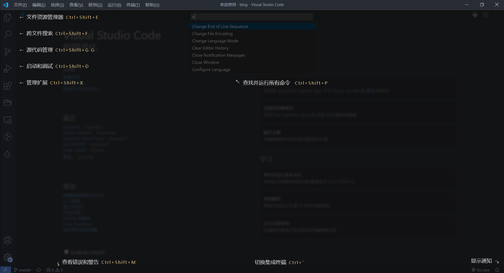

## VS Code 界面

::: tip

在完成 VS Code 安装并首次打开 VS Code 的时候，右下角会提示安装简体中文扩展，请点击安装。

如果忘记点击或没有弹窗，请到侧边栏扩展搜索找到 "Chinese (Simplified) Language Pack for Visual Studio Code" 扩展进行安装，即可将 VS Code 改为中文页面。

:::

VS Code 最上方有一排菜单栏，其中有大量的快捷操作，对应的组合键会标于快捷操作旁。如果不能记忆快捷键可以到最上方的菜单栏处查看。

最左侧是选项卡切换，从上至下依次是 [资源管理器](#资源管理器)、[搜索](#搜索)、[源代码管理](#源代码管理)、[调试](#调试) 和 [扩展](#扩展)。

最下方的一条是状态栏。从左到右依次是分支名称、同步状态、错误和警告个数、光标位置、缩进大小、编码格式、行尾序列、文件格式、反馈和通知。

### 资源管理器

资源管理器是最常使用的界面，快捷键为 `Ctrl + Shift + E`。资源管理器会列出当前项目内的所有文档，支持大纲展示。

### 搜索

搜索界面可以方便的对打开文件夹内的所有文本型文件进行关键字的搜索。搜索结果会详细的列出来，快捷键为 `Ctrl + Shift + F`。

搜索内容支持大小写敏感/不敏感、全字匹配、指定目录/文件搜索、正则表达式等高级功能。

### 源代码管理

源代码管理提供快速暂存、提交并同步更改的功能，快捷键为 `Ctrl + Shift + G`。源代码可以快速对当前项目文件进行暂存、打包与推送。

使用源代码需要安装 Git，详情请见请见 [Git 使用说明](../git/README.md)。

### 调试

在这里可以调试代码，快捷键为 `Ctrl + Shift + D`。针对不同的语言，您可能需要安装不同的扩展。

按下 F5 开始进行调试。在初次调试前，您可能要选择当前的环境与调试的内容。

### 扩展

VS Code 强大就强大在其丰富的扩展。尽管 VS Code 在安装后是一个轻量的编辑器，但是如果您安装了您所需的合适扩展，您完全可以将其配置成 IDE。

在商店中可以找到大量的扩展，快捷键为 `Ctrl + Shift + X`。对于功能相近的插件，尽量选择一些 star 数比较高的插件安装。

每个插件的主页通常会有对应的说明文件，安装插件后请仔细阅读说明文档以了解插件的用法。

## 强大的扩展内容

VS Code 扩展允许第三方添加对以下内容的支持:

- 语言: 如 C++，C＃，Go，Java，Python，PHP，dart
- 工具: 如 ESLint，JSHint，PowerShell
- 调试器: Chrome，PHP XDebug，dart，Java
- 键盘映射: Vim，Sublime Text，IntelliJ，Emacs，Atom，Visual Studio，Eclipse

扩展集成到 VS Code 的 UI，命令和任务运行系统中，因此您将发现通过 VS Code 的共享界面可以轻松使用不同的技术。

扩展可以通过按 `F1` 或者 `Ctrl + Shift + P` 来打开命令行窗口，并输入 `ext install 扩展名称` 来进行安装

::: tip

一些非常有用的扩展请见 [VS Code 扩展建议](./guide/extension.md#扩展建议)

:::
