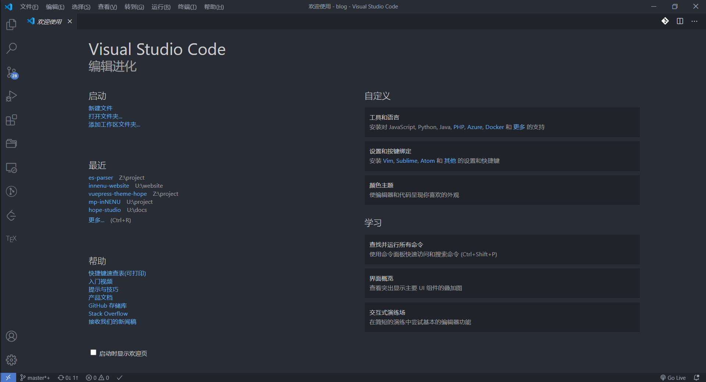
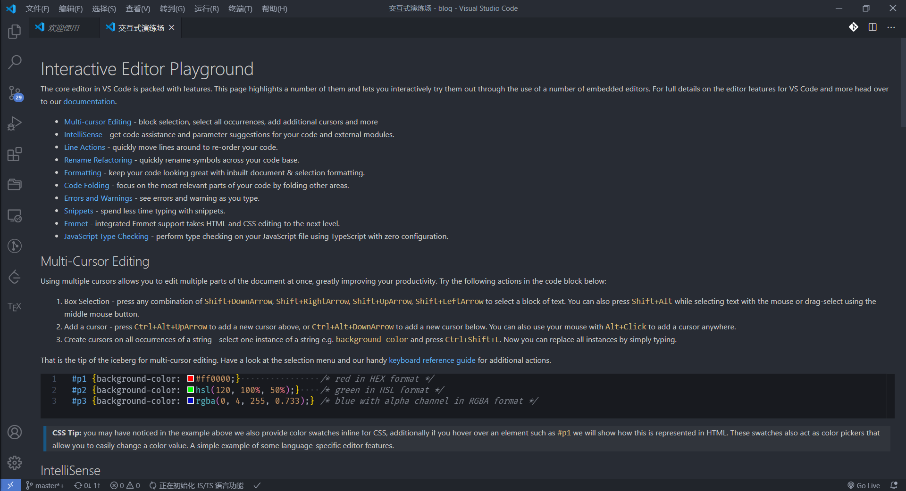
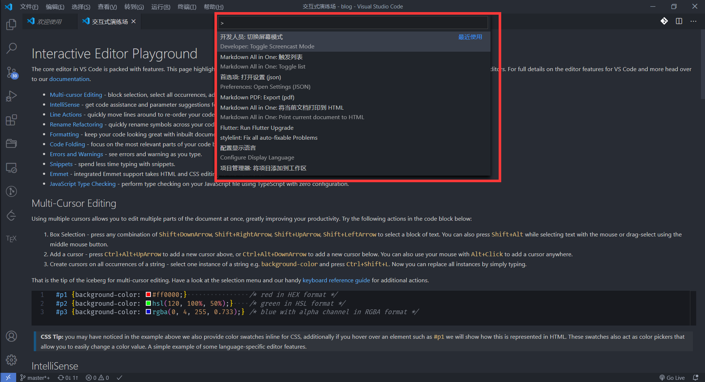
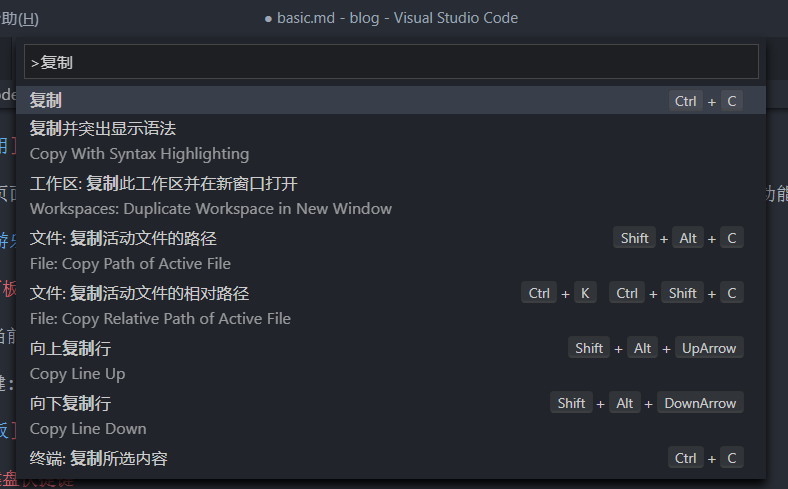
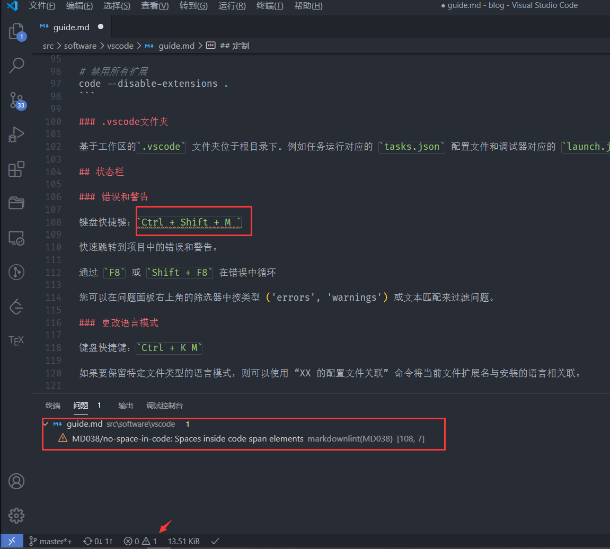
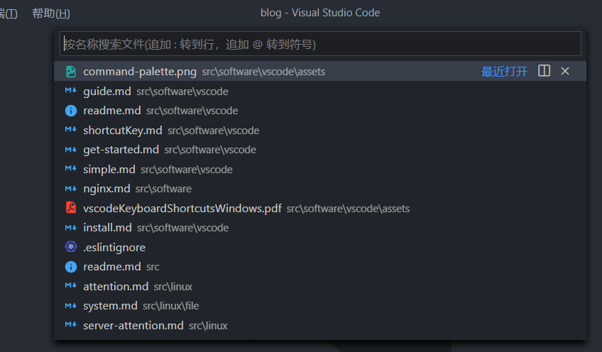
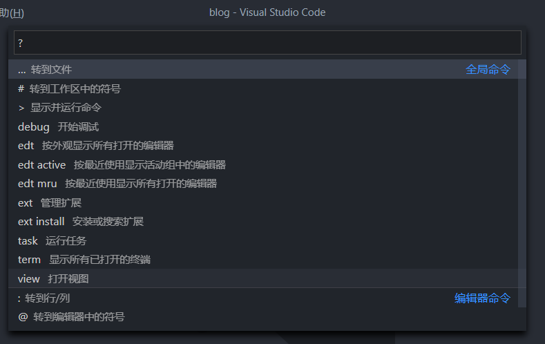
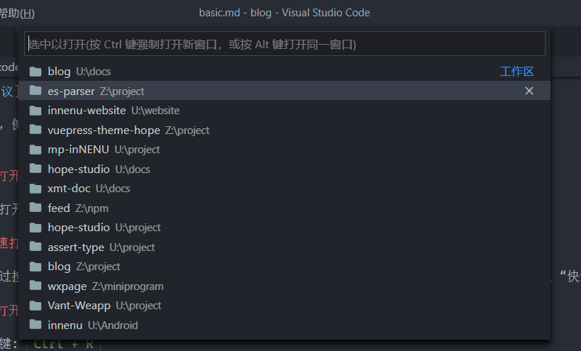
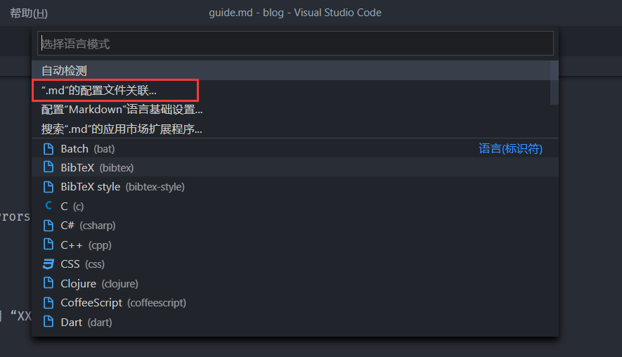

## 入门

打开 **欢迎使用** 页面，开始使用 VS Code 的基础知识。**帮助 > 欢迎**

在 **欢迎** 页面的右下角，有一个指向 **交互式游乐场** 的链接，您可以在其中交互式地试用 VS Code 的功能。**帮助 > 交互式游乐场**

## 命令面板

根据您的当前上下文访问所有可用命令。

键盘快捷键: `Ctrl + Shift + P`

## 默认键盘快捷键

所有命令都在命令面板中，并带有关联的键绑定(如果存在)。如果您忘记了键盘快捷键，请使用 **命令面板** 来帮助您。

## 错误和警告

键盘快捷键: `Ctrl + Shift + M`

快速跳转到项目中的错误和警告。

通过 `F8` 或 `Shift + F8` 在错误中循环

您可以在问题面板右上角的筛选器中按类型 (errors, warnings) 或文本匹配来过滤问题。

## 集成终端

键盘快捷键: `` Ctrl + ` ``

::: tip 深入了解

- [集成终端文档](https://code.visualstudio.com/docs/editor/integrated-terminal)
- [精通 VS Code 终端的文章](https://www.growingwiththeweb.com/2017/03/mastering-vscodes-terminal.html)

:::

## 键盘参考表

[Windows 下 VS Code 快捷键指南](/file/vscodeKeyboardShortcutsWindows.pdf) (英文)

## 快速打开

快速打开文件。

键盘快捷键: `Ctrl + P`

::: tip

键入 `?` 查看命令建议。

键入命令，例如 `edt` 和 `term` 后跟一个空格，将显示下拉列表。

:::

## 最近打开的文件之间的浏览

重复快速打开键盘快捷键，以在最近打开的文件之间快速循环。

## 从快速打开打开多个文件

您可以通过按向鼠标右键从 **快速打开** 中打开多个文件。这将在后台打开当前选择的文件，您可以继续从 **快速打开** 中选择文件。

## 最近打开的文件夹和工作区之间导航

键盘快捷键: `Ctrl + R`

显示快速挑选下拉从列表 `文件 > 打开最近`。优先使用最近打开的文件夹和工作空间，然后是文件。

## 更改语言模式

键盘快捷键: `Ctrl + K M`

如果要保留特定文件类型的语言模式，则可以使用 **XX 的配置文件关联** 命令将当前文件扩展名与安装的语言相关联。
