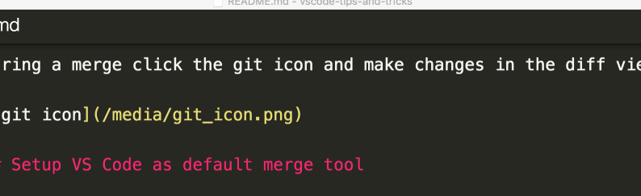
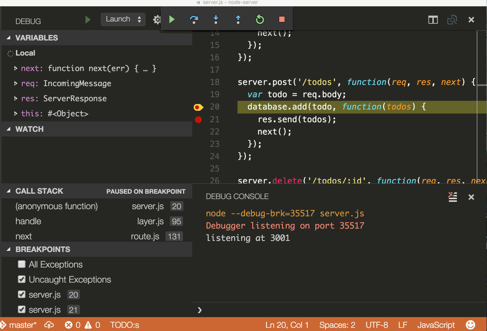
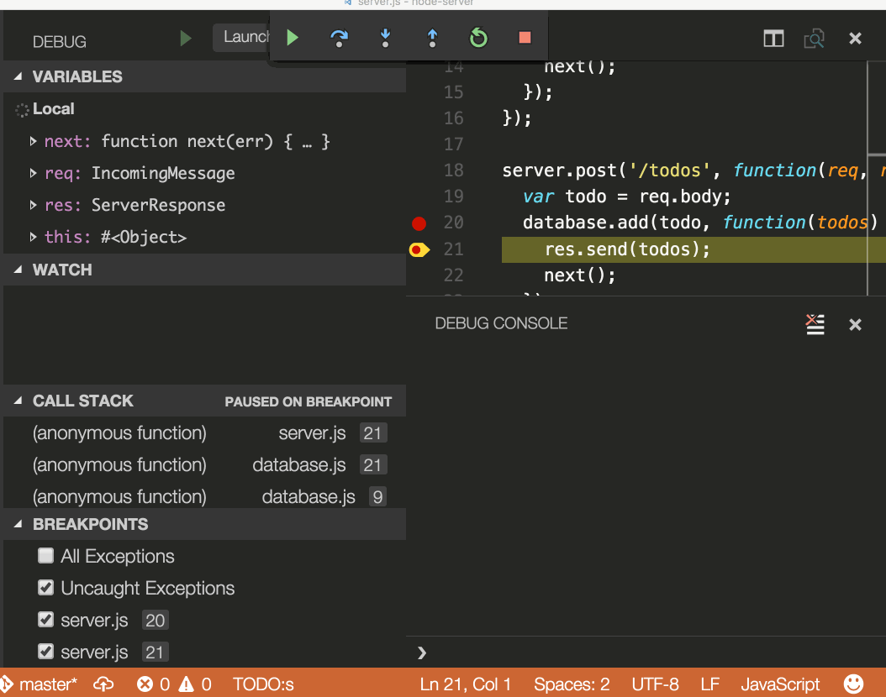

## 配置调试器

打开命令面板(`Ctrl + Shift + P`)，然后选择 **调试: 打开 launch.json**，这将提示您选择与项目(Node.js，Python，C ++等)匹配的环境。这将生成一个 `launch.json` 文件。Node.js 支持是内置的，其他环境要求安装适当的语言扩展。有关更多详细信息，请参见 [调试文档](https://code.visualstudio.com/docs/editor/debugging)。

## 断点并逐步执行

在行号旁边放置断点。使用 **调试** 小部件向前导航。

## 数据检查

在 **运行** 面板和控制台中检查变量。

## 内嵌值

您可以设置 `"debug.inlineValues": true` 在调试器中内联查看变量值。此功能开销很大，并且可能会减慢步进速度，因此默认情况下禁用此功能。

## Log Points

日志点的行为很像断点，但它们不会在命中时暂停调试器，而是在控制台中记录一条消息。日志点对于调试无法修改或暂停的生产服务器时注入日志特别有用。

使用左侧编辑器装订线中的 **添加日志点** 命令添加日志点，该日志点将显示为 :small_orange_diamond: 形状的图标。日志消息是纯文本，但可以包含要在花括号('{}')中计算的表达式。
