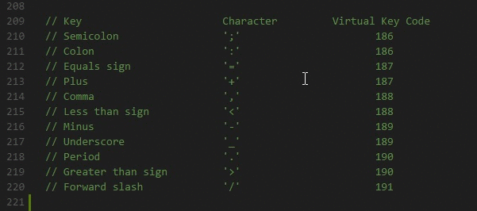
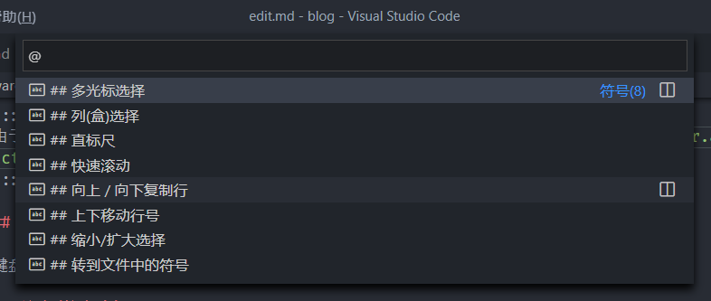
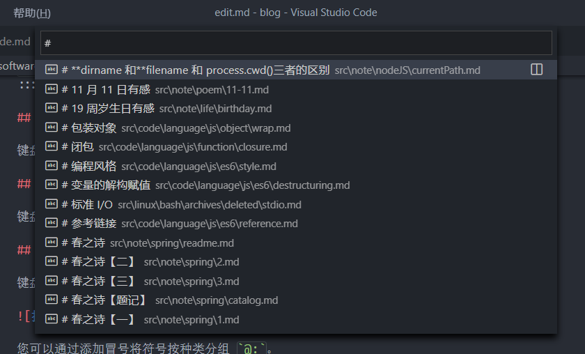
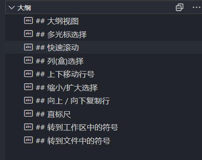
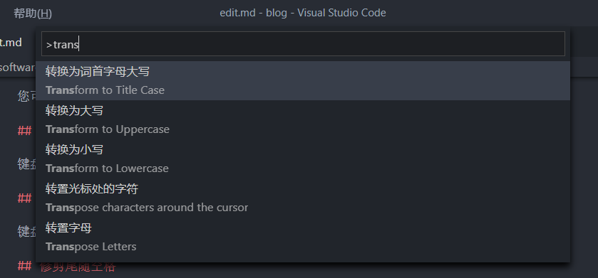
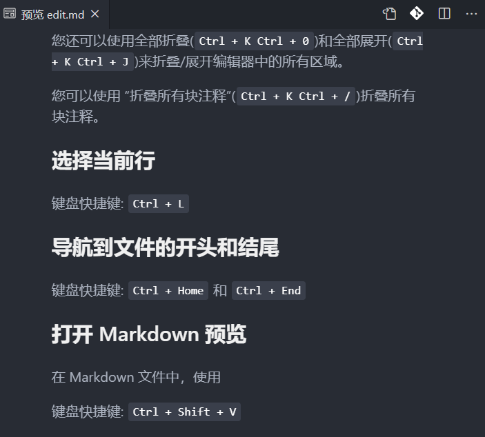
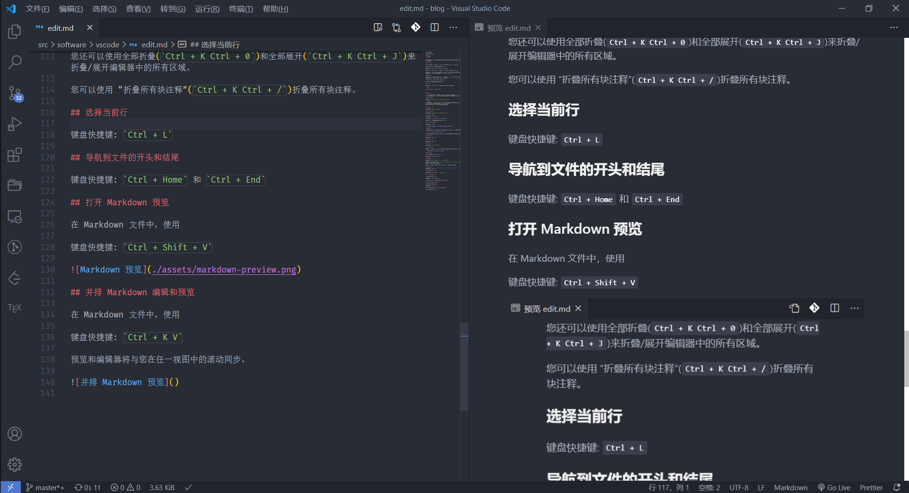

这是编辑代码的一些常用功能。如果您不喜欢键盘快捷键，请考虑为旧的编辑器安装键盘映射扩展名。

## 多光标选择

要在任意位置添加光标，请用鼠标选择一个位置，然后使用 `Alt + Click`。

要将光标设置在当前位置之上或之下，请使用:

键盘快捷键: `Ctrl + Alt + ↑` 或 `Ctrl + Alt + ↓`

您可以使用 `Ctrl + Shift + L` 将附加光标添加到当前选择的所有实例中。

如果不想添加所有当前选中项，则可以使用 `Ctrl + D` 代替。这只会选择您选择的选中项之后的下一个选中项，因此您可以一个一个地添加选择。

## 列(盒)选择

您可以在拖动鼠标时按住 `Shift + Alt`(在 macOS 上为 `Shift + Option`)来选择文本块。一个单独的光标将被添加到每一行的末尾。



您也可以使用键盘快捷键来触发列选择。

## 直标尺

您可以使用该 `editor.rulers` 设置将垂直列标尺添加到编辑器中。

```json
{
  "editor.rulers": [20, 40, 60]
}
```

## 快速滚动

按 `Alt` 键可在编辑器和资源管理器中快速滚动。默认情况下，快速滚动使用 5 倍速倍增器，但是您可以使用 `editor.fastScrollSensitivity` 设置来控制倍增器。

## 向上 / 向下复制行

键盘快捷键: `Shift + Alt + ↑` 或 `Shift + Alt + ↓`

::: info

由于按键冲突，在 Linux 上，向上 / 向下复制行没有默认的快捷键，您可以自行通过 `editor.action.copyLinesUpAction` 和 `editor.action.copyLinesDownAction` 设置自己的首选键盘快捷键。

:::

## 上下移动行号

键盘快捷键: `Alt + ↑` 或 `Alt + ↓`

## 缩小/扩大选择

键盘快捷键: `Shift + Alt + ←` 或 `Shift + Alt + →`

## 转到文件中的符号

键盘快捷键: `Ctrl + Shift + O`



您可以通过添加冒号将符号按种类分组 `@:`。

## 转到工作区中的符号

键盘快捷键: `Ctrl + T`



## 大纲视图

**文件资源管理器** 中的 **大纲** 视图(默认折叠在底部)显示了当前打开文件的符号。



您可以按符号名称，类别和文件中的位置进行排序，并可以快速导航到符号位置。

## 导航到特定行

键盘快捷键: `Ctrl + G`

## 恢复光标位置

键盘快捷键: `Ctrl + U`

## 修剪尾随空格

键盘快捷键: `Ctrl + K Ctrl + X`

## 转换文本命令

您可以使用 **命令面板** 中的 **转换** 命令将选定的文本更改为大写，小写和标题。



## 代码格式化

当前选择的源代码: `Ctrl + K Ctrl + F`

整个文档: `Shift + Alt + F`

## 代码折叠

键盘快捷键: `Ctrl + Shift + [` 和 `Ctrl + Shift +]`

您还可以使用全部折叠(`Ctrl + K Ctrl + 0`)和全部展开(`Ctrl + K Ctrl + J`)来折叠/展开编辑器中的所有区域。

您可以使用 **折叠所有块注释**(`Ctrl + K Ctrl + /`)折叠所有块注释。

## 选择当前行

键盘快捷键: `Ctrl + L`

## 导航到文件的开头和结尾

键盘快捷键: `Ctrl + Home` 和 `Ctrl + End`

## 打开 Markdown 预览

在 Markdown 文件中，使用

键盘快捷键: `Ctrl + Shift + V`



## 并排 Markdown 编辑和预览

在 Markdown 文件中，使用

键盘快捷键: `Ctrl + K V`

预览和编辑器将与您在任一视图中的滚动同步。


