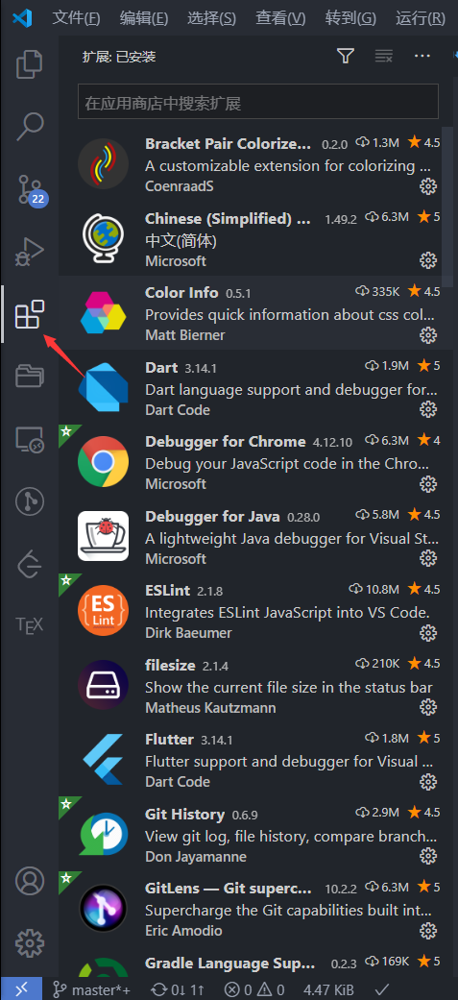

键盘快捷键: `Ctrl + Shift + X`

## 查找扩展

1. 在 VS Code 应用商店
1. 在 VS Code 侧边栏中的 **扩展** 选项卡
1. 查看扩展建议
1. 社区策划的扩展列表，例如 [awesome-vscode](https://viatsko.github.io/awesome-vscode/)。

## 安装扩展

在扩展视图中，您可以通过搜索栏进行搜索，或单击 **更多(...)** 按钮以按安装数量进行过滤和排序。

## 扩展建议

在 **扩展** 视图中，单击 **更多(...)** 按钮菜单中的 **显示推荐的扩展**。
