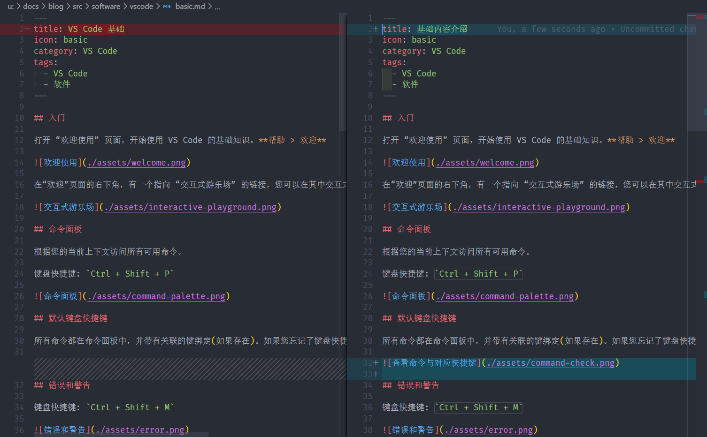
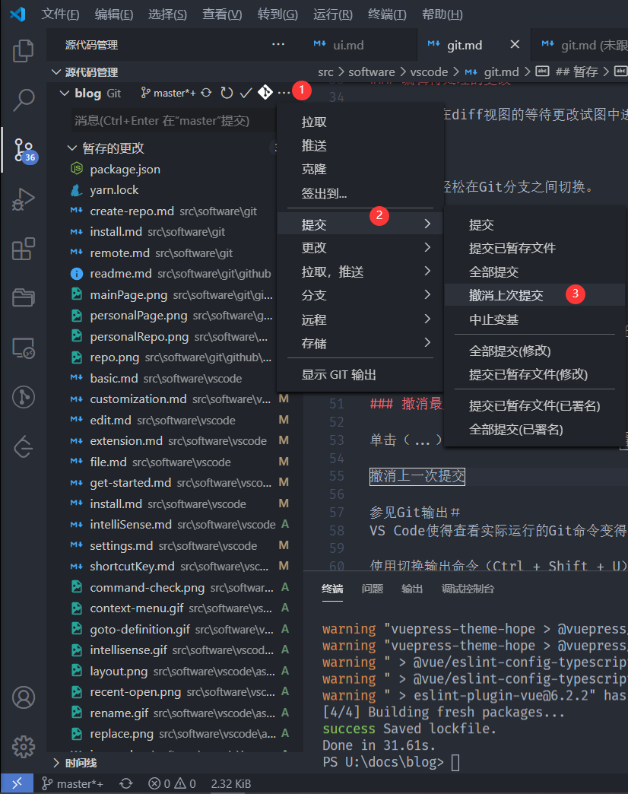
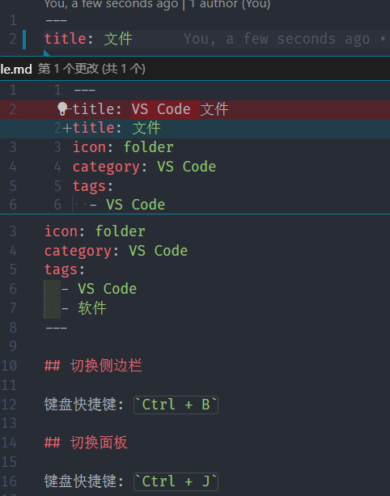

键盘快捷键: `Ctrl + Shift + G`

VS Code 有开箱即用的 Git 集成。您可以从扩展市场中安装其他 SCM 提供程序。本节描述了 Git 集成。

## 差异

从 **源代码管理** 视图中，选择一个文件以打开差异。

### 视图布局

差异的默认视图是并排视图。

切换内嵌视图: 点击更多操作右上角(...)按钮，然后选择切换内嵌视图。

如果您喜欢嵌入式视图，可以设置 `"diffEditor.renderSideBySide": false`。

### 审查窗格

使用 `F7` 和 `Shift + F7` 浏览差异。这将以统一的补丁格式显示它们。可以使用箭头键浏览行，然后按 Enter 键将在差异编辑器和所选行中跳回。

### 编辑待处理的更改

您可以直接在 diff 视图的等待更改试图中进行编辑。

## 分支

通过状态栏轻松在 Git 分支之间切换。

切换分支

## 暂存

### 暂存文件更改

- 将鼠标悬停在文件上，然后单击加号按钮。

- 单击减号按钮可以取消更改。

### 撤消最后提交

单击(...)按钮，然后选择 **提交 > 撤消上一次提交** 以撤消上一次提交。所做的更改将添加到 **暂存的更改** 部分。

## 查看 Git 输出

VS Code 使得查看实际运行的 Git 命令变得容易。在学习 Git 或调试困难的源代码管理问题时，这很有用。

使用 **切换输出命令** (`Ctrl + Shift + U`)，然后在下拉菜单中选择 Git。

## 增删指示

在编辑器中查看差异提示。有关更多详细信息，请参见文档。

## 解决合并冲突

在合并过程中，转到 **源代码管理** 视图(`Ctrl + Shift + G`)，然后在 diff 视图中进行更改。

您可以使用内联 CodeLens 解决合并冲突，内联 CodeLens 允许您 **接受当前更改**，**接受传入更改**，**接受两个更改** 以及 **比较更改**。
