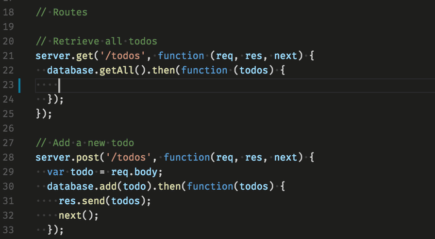
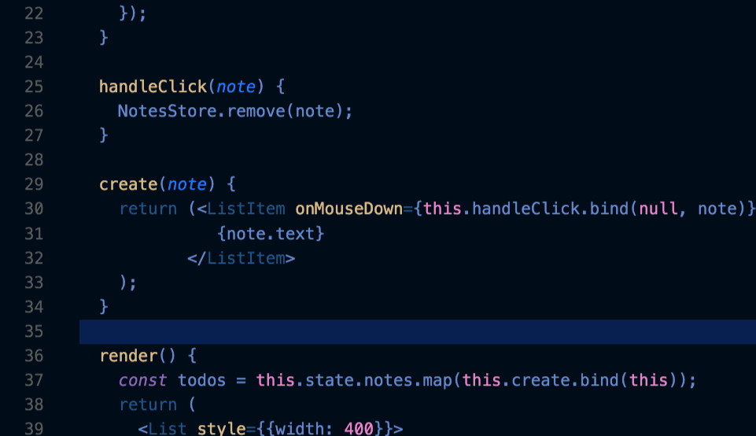
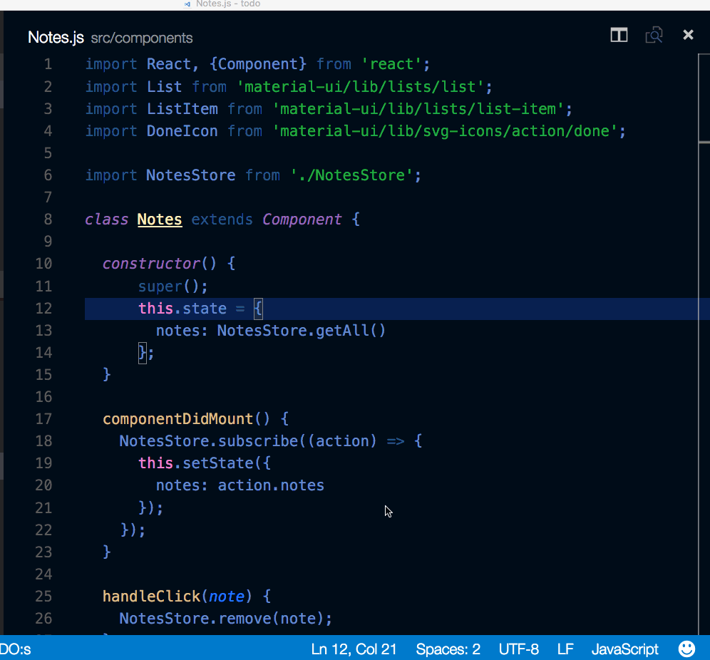
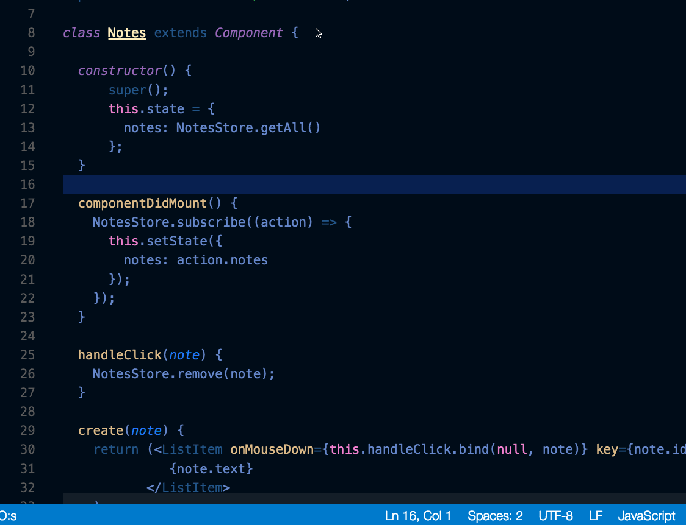

使用 `Ctrl + Space` 触发智能提示组件。



您可以查看可用的方法，参数提示，简短文档等。

## 跳转

选择一个符号然后输入 `Alt + F12`，您就可以使用上下文菜单了。



## 跳转到定义

选择一个符号然后输入 `F12`，您也可以使用上下文菜单或 `Ctrl + Click`



您可以使用 **转到 > 返回** 命令或快捷键 `Alt + ←` 来返回您的上个位置。

## 跳转到引用

选择一个符号输入 `Shift + F12`，即可打开上下文菜单查看所有引用。

## 查看所有引用

选择一个符号，然后按 `Shift + Alt + F12` 打开 **引用** 视图，在专用视图中显示文件的所有符号。

## 重命名符号

选择一个符号，然后按下 `F2`。或者，您可以使用上下文菜单。



## 搜索和修改

除了搜索和替换表达式之外，您还可以使用带有捕获组的正则表达式搜索和重用匹配的部分。通过单击 **使用正则表达式** `.*` 按钮(`Alt + R`)在搜索框中启用正则表达式，然后编写正则表达式并使用括号定义组。然后，您可以在替换字段使用 `$1`，`$2` 等来输入每个组中匹配的内容。


## .eslintrc.json

安装 ESLint 扩展，并根据您的需要配置。请查阅 ESLint 规范以获取有关其格式化规则和选项的详细信息。

这是使用 ES6 的配置。

```json
{
  "env": {
    "browser": true,
    "commonjs": true,
    "es6": true,
    "node": true
  },
  "parserOptions": {
    "ecmaVersion": 6,
    "sourceType": "module",
    "ecmaFeatures": {
      "jsx": true,
      "classes": true,
      "defaultParams": true
    }
  },
  "rules": {
    "no-const-assign": 1,
    "no-extra-semi": 0,
    "semi": 0,
    "no-fallthrough": 0,
    "no-empty": 0,
    "no-mixed-spaces-and-tabs": 0,
    "no-redeclare": 0,
    "no-this-before-super": 1,
    "no-undef": 1,
    "no-unreachable": 1,
    "no-use-before-define": 0,
    "constructor-super": 1,
    "curly": 0,
    "eqeqeq": 0,
    "func-names": 0,
    "valid-typeof": 1
  }
}
```

## package.json

IntelliSense 会为 package.json 文件提供智能提示。

## Emmet 语法

支持 [Emmet 语法](../../../code/website/emmet/README.md)。
