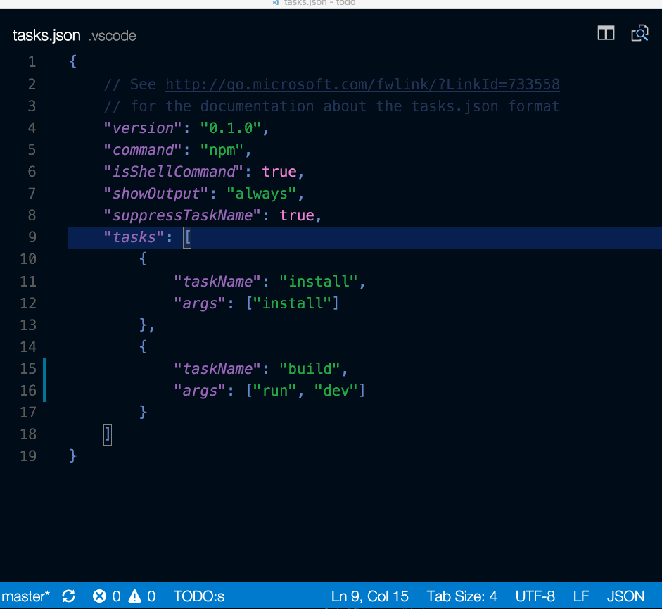

## 自动检测任务

从顶层菜单中选择**终端**，运行命令**配置任务**，然后选择您要运行的任务类型。这将生成一个 `tasks.json` 文件。有关更多详细信息，请参见 [任务文档](https://code.visualstudio.com/docs/editor/debugging)。

```json
{
  // See <https://go.microsoft.com/fwlink/?LinkId=733558>
  // for the documentation about the tasks.json format
  "version": "2.0.0",
  "tasks": [
    {
      "type": "npm",
      "script": "install",
      "group": {
        "kind": "build",
        "isDefault": true
      }
    }
  ]
}
```

自动生成有时会出现问题。请查阅文档，以确保一切正常。

## 从终端菜单运行任务

从顶层菜单中选择 **终端 > 运行任务**，然后选择要运行的任务。通过运行命令 **终止任务** 终止正在运行的任务



## 定义任务的键盘快捷键

您可以为任何任务定义键盘快捷键。从命令面板(`Ctrl + Shift + P`)中，选择 **首选项: 打开键盘快捷方式文件**，将所需的快捷方式绑定到 `workbench.action.tasks.runTask` 命令，然后将 任务 定义为 `args`。

例如，要将 `Ctrl + H` 绑定到 **运行任务**，请添加以下内容:

```json
{
  "key": "ctrl+h",
  "command": "workbench.action.tasks.runTask",
  "args": "Run tests"
}
```

## 从资源管理器中将 npm 脚本作为任务运行

使用该设置 `npm.enableScriptExplorer`，您可以启用一个浏览器，该浏览器显示在工作空间中定义的脚本。

在资源管理器中，您可以在编辑器中打开脚本，将其作为任务运行，然后使用节点调试器启动它(当脚本定义了诸如 `--inspect-brk` 的调试选项时)。单击时的默认操作是打开脚本。要单击运行脚本，请设置 `npm.scriptExplorerAction` 为 **运行**。使用 `npm.exclude` 设置可以排除 `package.json` 特定文件夹中包含的文件中的脚本。

通过设置 `npm.enableRunFromFolder`，您可以启用从文件资源管理器的上下文菜单中为文件夹运行 npm 脚本的功能。选择文件夹后，该设置将启用命令 **在文件夹中运行 npm 脚本...**。该命令显示此文件夹中包含的 npm 脚本的快速选择列表，您可以选择要作为任务执行的脚本。
