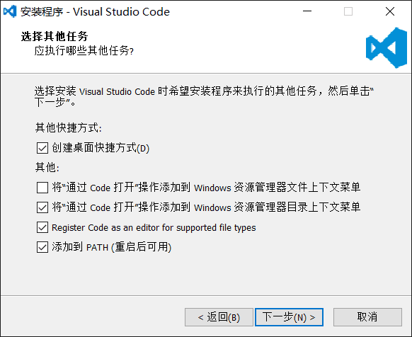
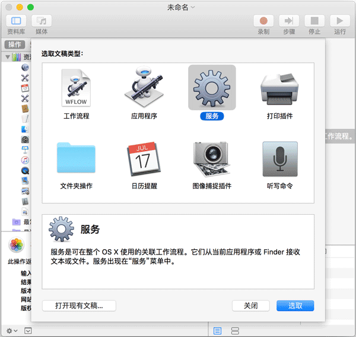
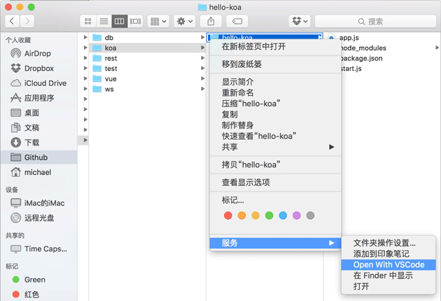

# VS Code 安装

## 下载

在 [官网下载地址](https://code.visualstudio.com/Download) 下载最新版安装包(Window User 64bit, 那个大的蓝色按钮就是)。

## 安装

- 双击安装包打开

- 同意用户协议。

- 安装选项中，请务必 **全选** 以下选项:

  

  勾选 **添加到目录上下文菜单**、**添加到文件上下文菜单**、**将 code 注册为受支持的文件编辑器**、**添加到 path**。

- 在 VS Code 初次启动后，若未提前安装 Git 可能会提示未找到 Git 软件，忽略即可

- 推荐立即执行简体中文扩展安装以保证界面语言为简体中文。

  ::: tip

  当您安装 VS Code 并第一次打开的时候，VS Code 会自动检测当前系统语言并在右下角推荐您安装对应语言的扩展，点击按钮即可自动安装。

  :::

## 更新频率

VS Code 每月发布一个具有新功能和重要错误修复的新版本。大多数平台都支持自动更新，并且会在新版本发布时提示您安装新版本。您还可以通过运行左下角 **管理 → 检查更新** 来手动检查更新。

## 用 VS Code 打开文件和文件夹

VS Code 支持打开文件和文件夹。

- 打开文件时请在文件图标上单击右键—选择 **使用 VS Code 打开**；

- 打开文件夹请双击打开文件夹，在空白处单击右键——选择 **用 VS Code 打开**。

### Mac 添加 **通过 Code 打开**

在 Mac 系统上，Finder 选中一个目录，右键菜单并没有 **通过 Code 打开** 这个操作。不过我们可以通过 Automator 自己添加这个操作。

先运行 Automator，选择 **服务**:



然后，执行以下操作:


1. 在右侧面板选择 **服务** 收到选定的 **文件夹**，位于 “Finder.app”，该选项是为了从 Finder 中接收一个文件夹；

1. 在左侧面板选择 **实用工具**，然后找到 **运行 Shell 脚本**，把它拽到右侧面板里；

1. 在右侧 **运行 Shell 脚本** 的面板里，选择 Shell **/bin/bash**，传递输入 **作为自变量**，然后修改 Shell 脚本如下:

```sh
for f in "$@"
do
    open -a "Visual Studio Code" "$f"
done
```

保存为 **Open With VS Code** 后，打开 Finder，选中一个文件夹，点击右键， **服务**，就可以看到 **Open With VS Code** 菜单:


