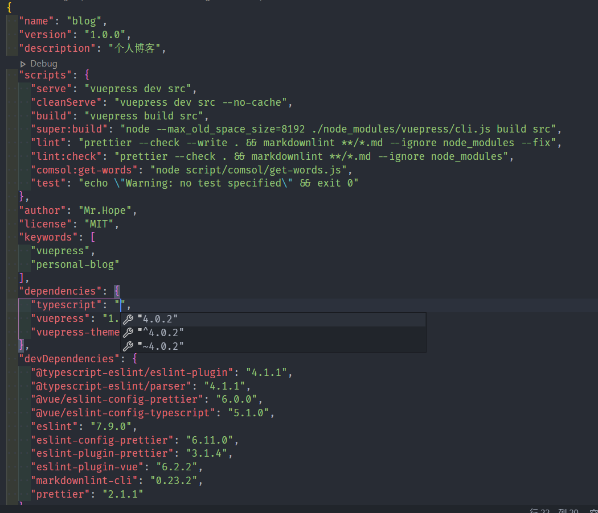
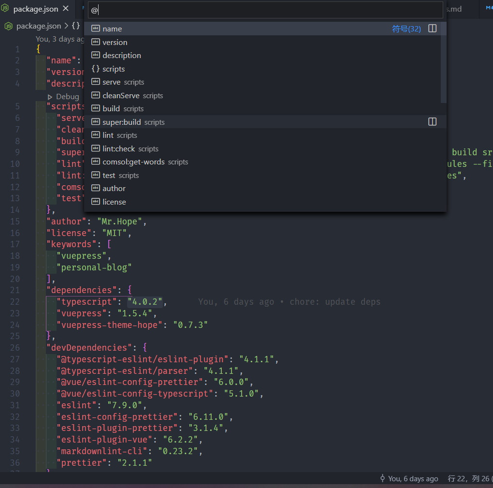
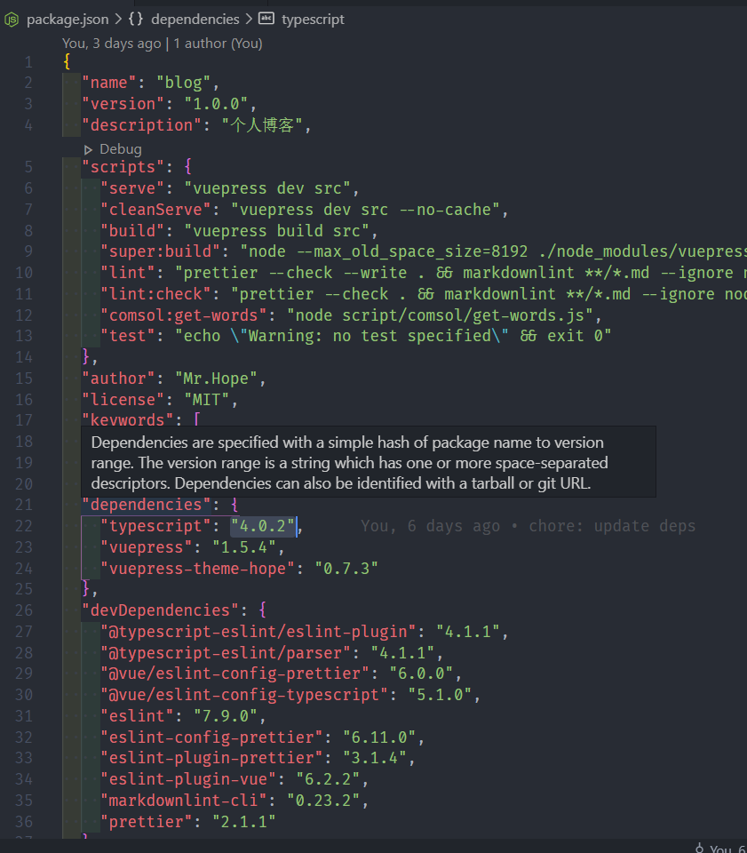
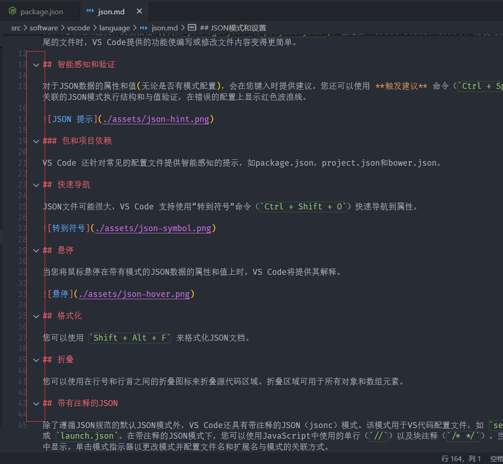

JSON 是常见配置文件的数据格式 (例如 `package.json` 或 `project.json`)，也是在 Visual Studio Code 中广泛使用的配置文件。当打开以 `.json` 结尾的文件时，VS Code 提供的功能使编写或修改文件内容变得更简单。

## 智能感知和验证

对于 JSON 数据的属性和值(无论是否有模式配置)，会在您键入时提供建议。您还可以使用 **触发建议** 命令(`Ctrl + Space`)手动查看建议。我们还基于关联的 JSON 模式执行结构和与值验证，在错误的配置上显示红色波浪线。



### 包和项目依赖

VS Code 还针对常见的配置文件提供智能感知的提示，如 package.json，project.json 和 bower.json。

## 快速导航

JSON 文件可能很大，VS Code 支持使用 **转到符号** 命令(`Ctrl + Shift + O`)快速导航到属性。



## 悬停

当您将鼠标悬停在带有模式的 JSON 数据的属性和值上时，VS Code 将提供其解释。



## 格式化

您可以使用 `Shift + Alt + F` 来格式化 JSON 文档。

## 折叠

您可以使用在行号和行首之间的折叠图标来折叠源代码区域。折叠区域可用于所有对象和数组元素。



## 带有注释的 JSON

除了遵循 JSON 规范的默认 JSON 模式外，VS Code 还具有带注释的 JSON(jsonc)模式。该模式用于 VS 代码配置文件，如 `settings.json`，`tasks.json` 或 `launch.json`。在带注释的 JSON 模式下，您可以使用 JavaScript 中使用的单行(`//`)以及块注释(`/* */`)。当前的编辑器模式在编辑器的状态栏中显示。单击模式指示器以更改模式并配置文件名和扩展名与模式的关联方式。

## JSON 验证

JSON 验证默认情况下对许多文件类型启用。在 `settings.json` 中，你可以创建自己的架构和验证:

```json
"json.schemas": [
  {
    "fileMatch": ["/bower.json"],
    "url": "https://json.schemastore.org/bower"
  }
]
```

或在工作区内定义文件架构:

```json
"json.schemas": [
  {
    "fileMatch": ["/foo.json"],
    "url": "./myschema.json"
  }
]
```

或自定义架构

```json
"json.schemas": [
  {
    "fileMatch": ["/.myconfig"],
    "schema": {
      "type": "object",
      "properties": {
        "name" : {
          "type": "string",
          "description": "The name of the entry"
        }
      }
    }
  }
]
```

::: tip 什么是 JSON Schema?

JSON Schema 描述 JSON 文件的架构，以及其值的取集和默认值，换句话说，JSON Schema 是 JSON 文件的一个具体结构的介绍与规定和值规范的说明。

JSON Schema 可以规定 JSON 文件中需要有哪些键，不能包含哪些键、哪些键是可选的，同时还可以每个键的配置内容是什么，这些键可以填入哪些值等。

:::

更多内请参阅下方的高级内容。

---

以下是高级内容:

## JSON 模式和设置

为了了解 JSON 文件的结构，VSCode 使用 JSON 模式。JSON 模式描述 JSON 文件的形状以及值集，默认值和描述。VS Code 的 JSON 支持支持 JSON Schema Draft 7。

诸如 JSON Schema Store 之类的服务器为大多数常见的基于 JSON 的配置文件提供了架构。但是，也可以在 VS Code 工作区中的文件以及 VS Code 设置文件中定义架构。

可以使用 `$schema` 属性在 JSON 文件本身中，也可以在属性下的用户或工作区设置(文件 > 首选项 > 设置)中使用 `json.schemas` 完成 JSON 文件与模式的关联 。

VS Code 扩展还可以定义架构和架构映射。这就是为什么 VS Code 已经知道一些知名 JSON 的模式文件，如 `package.json`，`bower.json` 和 `tsconfig.json`。

### JSON 映射

在以下示例中，JSON 文件指定其内容遵循 CoffeeLint 模式。

```json
{
  "$schema": "https://json.schemastore.org/coffeelint",
  "line_endings": "unix"
}
```

请注意，此语法是特定于 VS Code 的，而不是 JSON Schema 规范的一部分。

### 在用户设置中设置映射

以下用户设置摘录显示了 `.babelrc` 文件如何映射到位于 <https://json.schemastore.org/babelrc> 上的 babelrc 模式。

```json
"json.schemas": [
  {
    "fileMatch": ["/.babelrc"],
    "url": "https://json.schemastore.org/babelrc"
  }
]
```

::: tip
除了为 `.babelrc` 定义架构之外，还请确保`.babelrc` 与 JSON 语言模式相关联。也可以使用 `files.association` 数组设置在设置中完成此操作。
:::

### 映射到工作区中的架构

要映射位于工作空间中的架构，请使用相对路径。在此示例中，工作空间根目录中名为 `myschema.json` 的文件将会用于验证所有以 `.foo.json` 结尾的文件。

```json
"json.schemas": [
  {
    "fileMatch": ["/*.foo.json"],
    "url": "./myschema.json"
  }
]
```

### 对设置配置定义模式映射

要映射 **用户** 或 **工作区** 设置中定义的架构，请使用该 `schema` 属性。在此示例中，定义了一个架构，该架构将用于 `.myconfig` 结尾的所有文件。

```json
"json.schemas": [
  {
    "fileMatch": ["/.myconfig"],
    "schema": {
      "type": "object",
      "properties": {
        "name" : {
          "type": "string",
          "description": "The name of the entry"
        }
      }
    }
  }
]
```

### 在扩展中映射架构

模式和模式关联也可以通过扩展定义。查看 。

### 文件匹配语法

文件匹配语法支持 `*` 通配符。另外，您可以定义排除模式，以 `!` 开头。为了使关联匹配，至少需要匹配一个模式，并且最后一个匹配模式不得为排除模式。

```json
  "json.schemas": [
    {
      "fileMatch": [
        "/receipts/*.json",
        "!/receipts/*.excluded.json"
      ],
      "url": "./receipts.schema.json"
    }
  ]
```

### 在 JSON 模式中定义片段

JSON 模式描述 JSON 文件的架构，以及其值的取集和默认值，JSON 语言支持人员使用它们来提供完成建议。如果您是架构作者，并且想提供更多的自定义完成建议，则还可以在架构中指定摘要。

以下示例显示了用于定义代码段的键绑定设置文件的架构:

```json
{
  "type": "array",
  "title": "Keybindings configuration",
  "items": {
    "type": "object",
    "required": ["key"],
    "defaultSnippets": [
        {
            "label": "New keybinding",
            "description": "Binds a key to a command for a given state",
            "body": { "key": "$1", "command": "$2", "when": "$3" }
        }
    ],
    "properties": {
        "key": {
            "type": "string"
        }
        ...
    }
  }
}
```

使用 `defaultSnippets` 属性可以为给定的 JSON 对象指定任意数量的代码段。

- `label` 和 `description` 会显示在完成选择对话框中。如果未提供标签，则片段的字符串化对象表示将显示为标签。

- `body` 是当用户选择完成时被字符串化并插入的 JSON 对象。代码段语法可用于字符串文字中，以定义制表符，占位符和变量。如果字符串以开头`^`，则字符串内容将原样插入，而不是按字符串插入。您可以使用它来指定数字和布尔值的片段。

请注意，`defaultSnippets` 不是 JSON 模式规范的一部分，而是 VS Code 特定的模式扩展。

## 离线模式

`json.schemaDownload.enable`控制 JSON 扩展是否使用 `http` 和 `https` 获取 JSON 模式。

当前编辑器想要使用无法下载的架构时，状态栏中会显示一个警告三角形。
