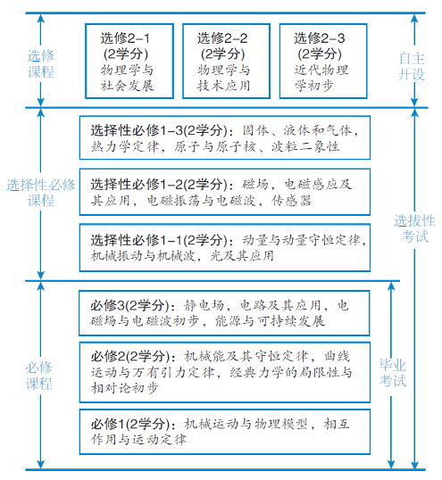

# § 绪论 物理学概述

## 物理是什么？

::: center

判天地之美，析万物之理。 ——庄子

:::

| 判天地之美 | 析万物之理      |
| ---------- | --------------- |
| 埃及金字塔 | 杠杆原理        |
| 过山车     | 向心运动        |
| 火箭升空   | 冲量            |
| 流星雨     | 摩擦生热        |
| 闪电       | 空气的电离      |
| 彩虹       | 光的色散        |
| 量子围栏   | 纳米科技(10-9m) |

## 物理学史

早在2000多年前的古希腊时期,亚里士多德、阿基米德等一批科学家就开始了对物理现象和规律的探索,并发现了杠杆原理、浮力定律等规律。这是物理学的萌芽时期。

经过四个世纪的发展,物理学已经成为一门分支众多深刻影响当代科学技术发展乃至人类社会文明进步的基础学科。

## 主要人物

- 亚里士多德（公元前384～前322），古希腊先哲，古代著名哲学家、科学家和教育家之一，被誉为希腊哲学的集大成者。他是柏拉图的学生，亚历山大的老师。
- 伽利略（1564～1642），意大利天文学家、物理学家、欧洲近代自然科学的创始人，被称为“观测天文学之父”、“现代物理学之父”。
- 牛顿（1643 ～ 1727），英国著名的物理学家、数学家。在力学上，牛顿阐明了动量和动量守恒的原理，提出牛顿运动定律。在光学上，他发明了反射望远镜，并基于对三棱镜将白光发散成可见光谱的观察，发展出了颜色理论。
- 法拉第（1791～1867），英国物理学家、化学家。1831年10月17日，法拉第首次发现电磁感应现象，被称为“电学之父”和“交流电之父”。
- 爱因斯坦（1879—1955），美国和瑞士双国籍的犹太裔物理学家。1905年，提出光子假设，成功解释了光电效应（因此获得1921年诺贝尔物理学奖），此后创立狭义相对论和广义相对论。
- 杨振宁，中国物理学家。在粒子物理学、统计力学和凝聚态物理等领域作出里程碑性贡献，1957年获诺贝尔物理学奖。

## 研究内容

物理学是一门描述物质运动和变化规律的学科。或者说，物理学是用来解释客观世界的各种物理现象，找到规律并加以应用的学科。

|          | 初中物理       | 高中物理                         |
| -------- | -------------- | -------------------------------- |
| 内容     | 物理现象       | 内在规律                         |
| 能力     | 记忆、理解为主 | 推理、分析、计算为主             |
| 问题     | 定性的         | 定量的                           |
| 问题     | 一维的         | 二维的、三维的                   |
| 问题     | 具象的         | 抽象的                           |
| 数学要求 | 简单计算       | 三角函数、不等式、求导、几何证明 |

## 如何学好高中物理

### 初高中物理的区别？

1. 初中物理教材通俗易懂，而高中物理教材文字叙述严谨，通常是不好理解的，甚至很多同学读了一遍都不知道是什么意思。
1. 初中物理主要学的是现象，现象本身就是知识点，我们直接背下来就可以了，而高中物理主要学的是逻辑，是用一个高度提炼的方法解决生活中千变万化的问题，他往往不是一句话就能解决的，而是有一系列的因果关系或者递进关系。
1. 和初中物理相比，高中物理知识点和知识点是紧密相连的，各知识校块层层递进、环环相扣，每一个知识点都很重要，前面基础的学习状态也会影响到后续的学习，而初中物理的知识点往往是独立的。
1. 初中物理的学习主要以听讲为主，而高中物理不仅要听讲，还需要课下大量的巩固和练习。

### 学习方法

1. 要重视听课，这是学物理的第一步高中物理内容多，且语言凝练抽象，是很难通过自学学懂的，一定要重视课堂学习，提高自己的听课效率，这比课下花几倍的时间弥补更有效果。
1. 做好笔记和改错物理课讲的内容量和深度都是远超教材的，老师讲课时会有个别内容上的拓展和补充，有个别不理解的也是正常情况，只要我们做好笔记和标注，不明白的课下反复的看或问老师，直到把知识点彻底弄懂认真对待学习中的每一次错误，认真改错，你会发现同样的错误你会不断地犯，只要多复习，就会逐渐避免。
1. 做好阶段性复习和总结高中物理知识点较多，并且前后有关联，因此，我们在平日学习中要有机会的做好复习和总结，争取实现物理知识、模型、方法体系化。
