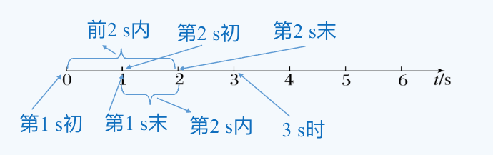
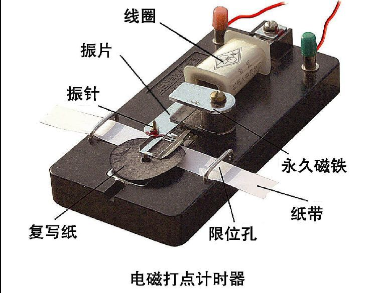
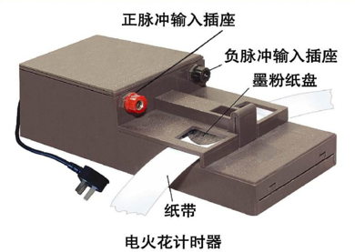

# §1.2 时间与位移

## 时刻与时间间隔

- **时刻**：某一瞬间，在时间轴上用点表示。
- **时间间隔**：两个时刻之间的间隔，在时间轴上用线段表示。

::: tip 生活中的时间

日常“时间”有时指时刻，有时指时间间隔，要结合语境判断。

- 什么时间出发？（时刻）
- 出发了多长时间？（时间间隔）

:::

## 坐标系

为了定量地描述物体的位置，需要在参考系上建立适当的坐标系。

1. 建立目的：定量描述物体的位置及位置的变化
1. 坐标系的三要素:原点、正方向和单位长度。
1. 常见的坐标系的种类：直线坐标系、平面坐标系和空间坐标系

## 路程

物体运动轨迹的长度。

## 位移

1. 物理意义：表示物体(质点)位置变化的物理量
1. 定义：从初位置指向末位置的一条有向线段
1. 大小：初、末位置间有向线段的长度
1. 方向：由初位置指向末位置

物体位置变化有两个要点：位置变化的大小；位置变化的方向。

## 位移与路程的区别

**区别**：

1. 位移有方向，路程无方向。
2. 位移大小 $\leq$ 路程。单向直线运动时，位移大小等于路程；其他情况，位移小于路程。
3. 位移只与初末位置有关，路程与路径有关。

::: tip

回到原点时，位移为零，路程不为零。

:::

## 直线运动的位移

研究直线运动时，在物体运动的直线上建立具有单个 $x$ 轴的一维坐标系，其中坐标表示位置，坐标变化量表示位移。

物体的位置用位置坐标表示，物体的位移用坐标变化量表示。

- 大小:末位置与初位置的坐标之差：$\Delta x=x_2-x_1$。

- 方向:初位置指向末位置。
  - $x>0$，表示位移的方向指向x轴的正方向
  - $x<0$，表示位移的方向指向x轴的负方向，

::: tip

位移的大小是坐标差的绝对值，方向由坐标正负决定。

:::

## 矢量和标量

1. 矢量：既有大小又有方向的物理量，如位移、力等。
1. 标量：只有大小、没有方向的物理量，如质量、时间、路程等。

::: info 有方向的物理量都是矢量吗？

不是。像速度、加速度等有方向的物理量是矢量，而像功、热量、电流、电压等有方向的物理量是标量。这些标量有正负之分以区分大小关系，但没有方向（不代表特定的空间方向）。

:::

## 位移和时间的测量

1. 实验室中常用打点计时器在纸带上打出的点迹分布来记录时间和位移
1. 纸带上各点之间的距离表示相应时间间隔内物体的位移大小。
1. 打点计时器工作原理：利用交流电的周期性变化，在纸带上打出一系列均匀分布的点迹。当电源频率是 50 Hz 时，每隔 0.02s打一次点。
1. 常见的打点计时器有两种：
   1. 电磁打点计时器：工作电压约为8V，由线圈、振片、振针、复写纸、限位孔、永久磁体组成。
   1. 电火花打点计时器：工作电压约为220V，由脉冲器、复写纸、限位孔等组成。

::: center

 

:::

::: warning 注意事项

1. 打点时，应先启动电源，待打点计时器打点稳定后再拉动纸带。
1. 打点计时器不能连续工作太长时间，打点之后应立即关闭电源。
1. 对纸带进行测量时，不要分段测量各段的位移，正确的做法是一次测量完毕即统一测量出各个计数点到起始点之间的距离。

:::

## 位移一时间图像

1. 定义：以时间 $t$ 为横轴，以位置 $x$ 为纵轴，建立平面直角坐标系，描出物体在各个时刻的位置，用平滑的曲线连接各点，就得到位移一时间图像（$x-t$ 图像）。
1. 物理意义：描述了物体的位移随时间的变化关系。
1. 只能描述直线运动，不能描述曲线运动。
1. 图像意义：
   1. 图像交点表示两个物体在同一时刻处于同一位置，即相遇。
   1. 图像的纵轴截距表示物体的初始位置。
   1. 图像上任意两点间的斜率表示物体在对应时间间隔内的平均速度。
